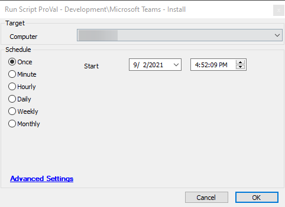

## Summary

This document describes the installation of the Teams Machine-wide Installer and the process to install Teams for the current user. It also covers the creation of a scheduled task to ensure that all users logging into the machine will have Teams installed automatically.

## Sample Run

## Dependencies

- [Deploy-MSTeams](https://proval.itglue.com/DOC-5078775-8204723)

## Process

Refer to [Deploy-MSTeams](https://proval.itglue.com/DOC-5078775-8204723) for detailed process information.

## Output

- Script log
- Local file on the computer

