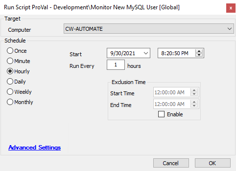

## Summary

**Description:**  
- Check the script state.  
- If the script state exists, then check if it has changed since the last run of the script and send the names to the email address stored in the global variable `@Email@`.  
- If the script state doesn't exist or is empty, fill it.

**Time Saved by Automation:** 7 minutes.

## Sample Run

## Variables

- `@Email@`: Email address passed as a global variable.  
- `@MySQLUsers_state@`: Value of the script state "MySQLUsers_state".  
- `@MySQLCompUsers@`: Names of the MySQL users added since the last runtime of the script.

#### Global Parameters

| Name  | Example                       | Required | Description                                                                                                                                       |
|-------|-------------------------------|----------|---------------------------------------------------------------------------------------------------------------------------------------------------|
| Email | [example@email.com](mailto:example@email.com) | True     | Sends the email to the address mentioned in the variable with names of the newly created MySQL users. To use multiple email addresses, each one should be separated by a semicolon ';'. |

## Process

1. Check the script state.  
2. If the script state exists, then check if it has changed since the last run of the script and send the names to the email address stored in the global variable `@Email@`.  
3. If the script state doesn't exist or is empty, fill it.

## Output

Email
