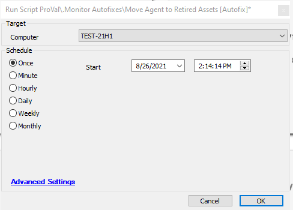

## Summary

This script will move the agent it is run against to retired assets. This can be used as an autofix to automatically retire agents.

**Time Saved by Automation:** 3 Minutes

**Note:** This should not be run manually; it should only be run through the monitor.

## Sample Run

## Process

This script runs a SQL query against the machine to retire it.
