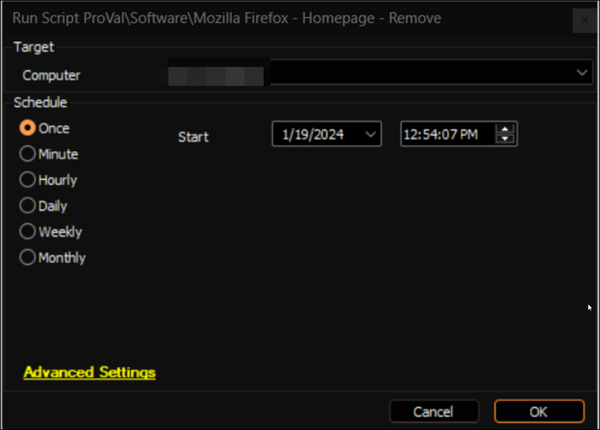

## Summary

It is an Automate implementation of the agnostic script [SWM - Software Configuration - Remove-FirefoxHomepage](https://proval.itglue.com/DOC-5078775-10372106) to remove the policy for an enforced homepage in Mozilla Firefox.

## Sample Run

## Dependencies

[SWM - Software Configuration - Remove-FirefoxHomepage](https://proval.itglue.com/DOC-5078775-10372106)

## Output

- Script Logs

