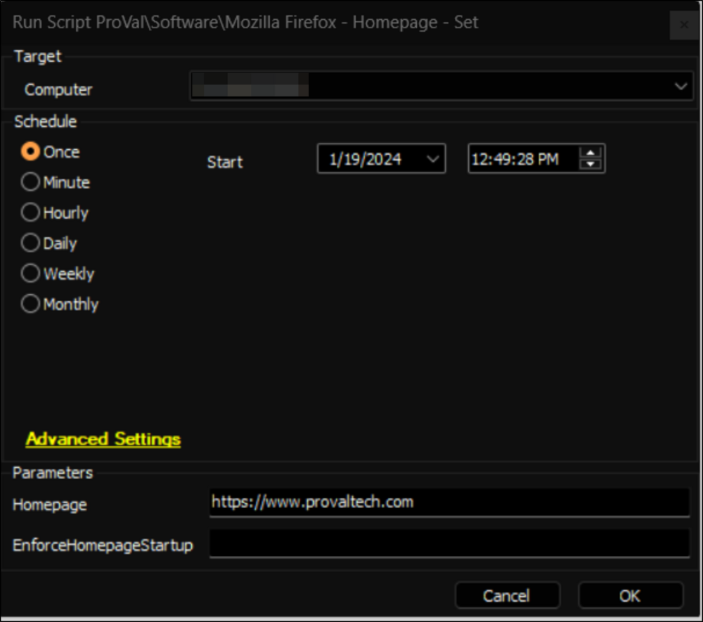

## Summary

This document provides an Automate implementation of the agnostic script [SWM - Software Configuration - Set-FirefoxHomepage](/docs/09a48350-5bd8-4d4a-8436-d1aa46bcd92e) to set the default homepage for the Mozilla Firefox browser.

## Sample Run

## Dependencies

[SWM - Software Configuration - Set-FirefoxHomepage](/docs/09a48350-5bd8-4d4a-8436-d1aa46bcd92e)

#### User Parameters

| Name                   | Example                               | Required | Description                                                                                   |
|------------------------|---------------------------------------|----------|-----------------------------------------------------------------------------------------------|
| Homepage               | [https://www.provaltech.com](https://www.provaltech.com) | True     | String value of the homepage to set in the browser.                                          |
| EnforceHomepageStartup  | 1                                     | False    | Set to 1 to force the homepage to be the only open tab at startup of the browser.            |

## Output

- Script Logs

