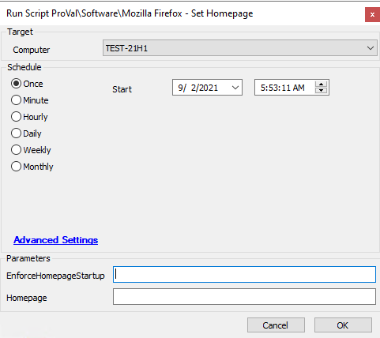

## Summary

This script adds the registry policy for an enforced homepage in Mozilla Firefox.

Time Saved by Automation: 10 Minutes

## Sample Run

## Dependencies

- Windows 10 1703+
- Mozilla Firefox installed
- [Set-FirefoxHomepage](https://proval.itglue.com/DOC-5078775-7348110)

## Variables

- `@PS1DataLog@` - Helps to verify if the script actually succeeded.
- `@PS1ErrorLog@` - Helps to track failure of the script.

#### User Parameters

| Name                      | Example                           | Required | Description                                                                                      |
|---------------------------|-----------------------------------|----------|--------------------------------------------------------------------------------------------------|
| -Homepage                 | [www.google.com](http://www.google.com/) | True     | The string value of the homepage to set in the browser.                                        |
| -EnforceHomepageStartup   | 1                                 | False    | Include this switch to force the homepage to be the only open tab at the startup of the browser. |

## Process

The script takes a string parameter to define the URL to set the homepage to. The applicable registry policies are applied to set the homepage to the one defined by the parameter. Optionally, switches can be used to enforce the homepage on startup.

## Output

- Script log
- Local file on computer

