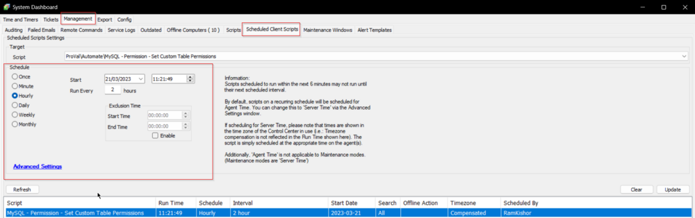

## Summary

This script will gather all users in the database and grant all required rights to any custom ProVal tables.

**Time Saved by Automation:** 5 Minutes

## Sample Run

The script is converted to a client script and should be scheduled to run every 2 hours.

## Variables

| Name             | Description                                                                                                                           |
| ---------------- | ------------------------------------------------------------------------------------------------------------------------------------- |
| UpdateStatements | This variable will store the SQL result, which will be further used as an update statement to grant permission to custom ProVal tables. |
