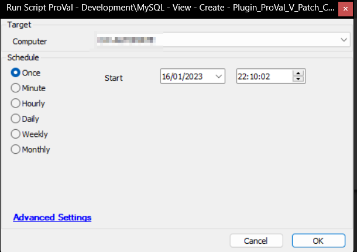

## Summary

This script creates the [CWM - Automate - View - Plugin_ProVal_V_Patch_Count_Status](<../views/Plugin_ProVal_V_Patch_Count_Status.md>) view.

## Sample Run

## Process

- Creates the view.
- Assigns the permissions of the view to all users.

## Output

- View

