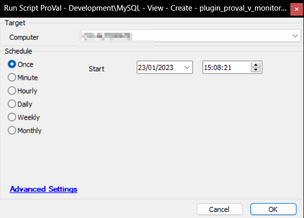

## Summary

This script creates the [View - plugin_proval_v_monitoraudit](https://proval.itglue.com/DOC-5078775-7998832) View, which populates the data in the [CWM - Automate - Dataview - Automate - Monitor Audit [View]](https://proval.itglue.com/DOC-5078775-8212748) dataview.

## Sample Run

## Process

- Drops the [View - plugin_proval_v_monitoraudit](https://proval.itglue.com/DOC-5078775-7998832) if it already exists.
- Creates the [View - plugin_proval_v_monitoraudit](https://proval.itglue.com/DOC-5078775-7998832).
- Assign View's permission to all users.

## Output

- View

