# Summary

This document outlines the implementation and removal of the entire Network Firewall solution.

# Sample Run

## Install the Solution

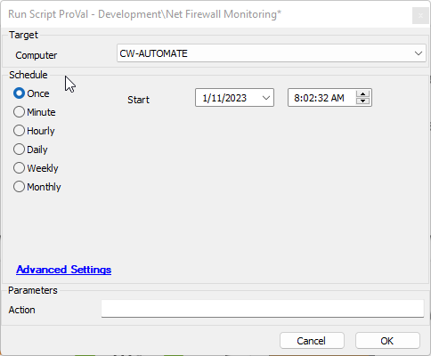

Leaving the Action blank or entering anything other than "uninstall" will install the solution based on the following condition:

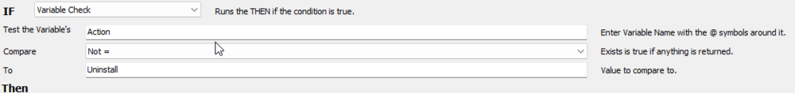

## Remove the Solution

Setting Action to "Uninstall" will remove the solution based on the following condition:

# Technician Required Steps

## Installation

1. Import the Net Firewall Monitoring script.
2. Run the Net Firewall Monitoring script with the Action blank or set to anything other than "Uninstall."
3. Go through your clients and set the SecurityCompliance EDF at any client you wish to monitor the net firewall.
4. Go through the client machines and set any exclusions to this monitoring in the computer-level SecurityCompliance Windows Firewall Monitoring Exclusion EDF.
5. Remove the Net Firewall Monitoring script from the system.

### Important Notes

1. Groups can take up to an hour to populate with data; please be patient when setting this up.

## Removal

1. Import the Net Firewall Monitoring script.
2. Run the Net Firewall Monitoring script with the Action set to "Uninstall."
3. Remove the Net Firewall Monitoring script from the system.

# Process (Installation)

## Creates the Network Firewall Monitor EDFs

- Client Level, under Security Compliance

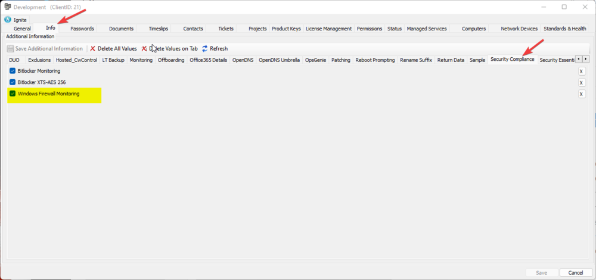

- Computer Level Exclusion under Security Compliance

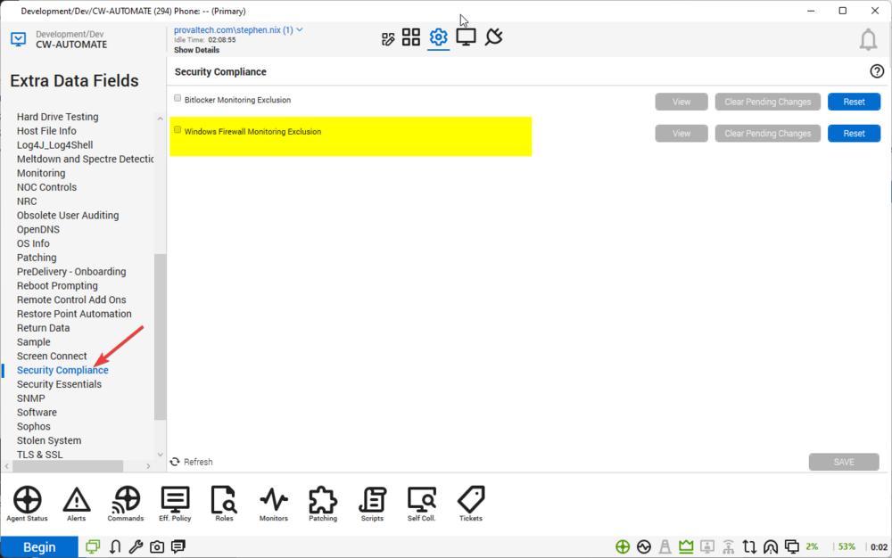

## Creates the Searches

- Windows Firewall Enabled

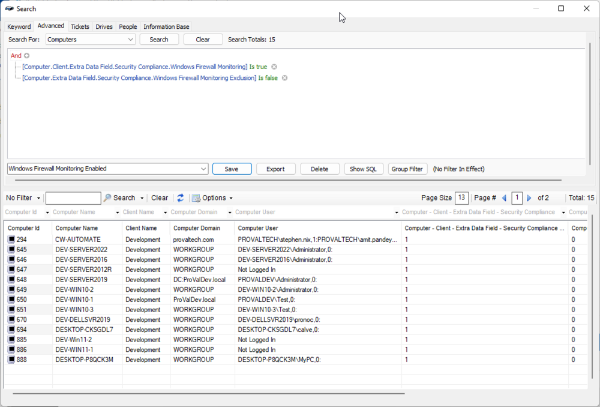

- Windows Firewall Monitoring Enabled - Servers

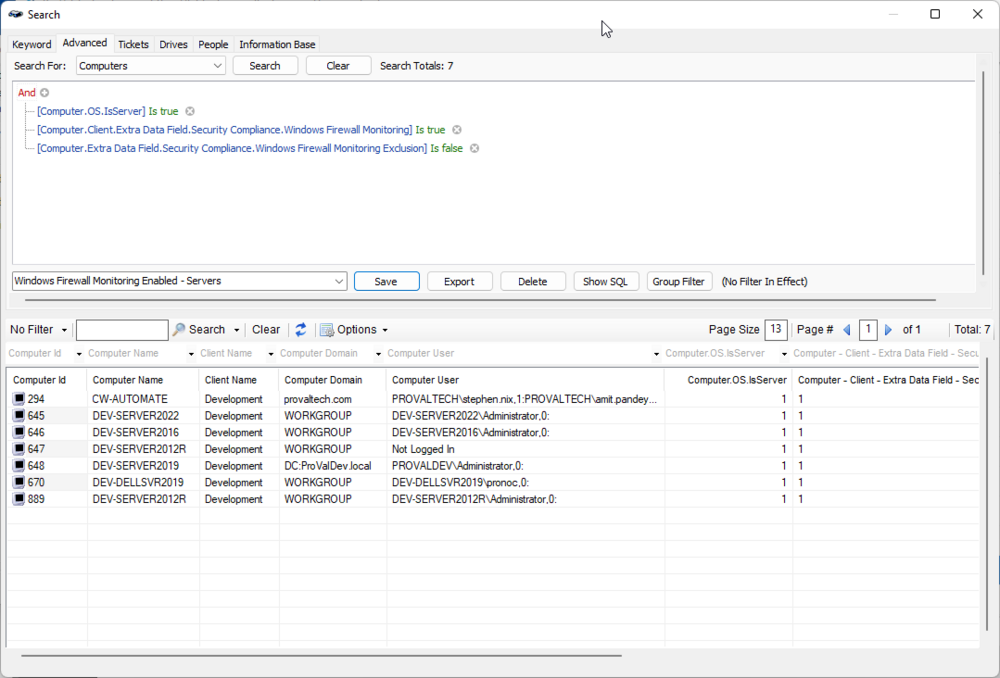

- Windows Firewall Monitoring Enabled - Workstations

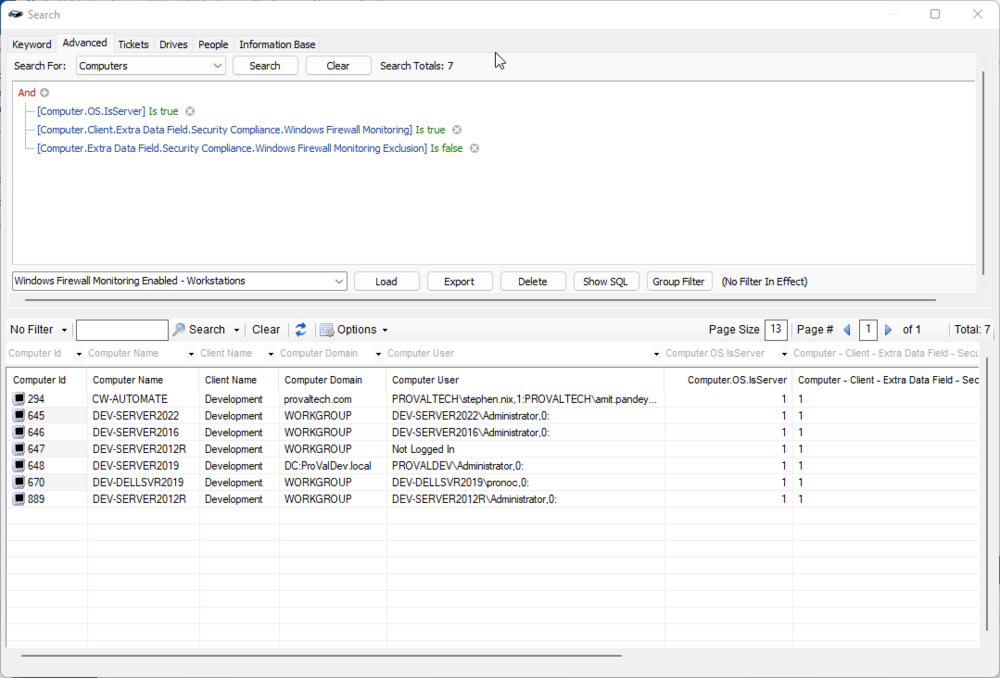

## Creates the Groups

- △ System Monitoring

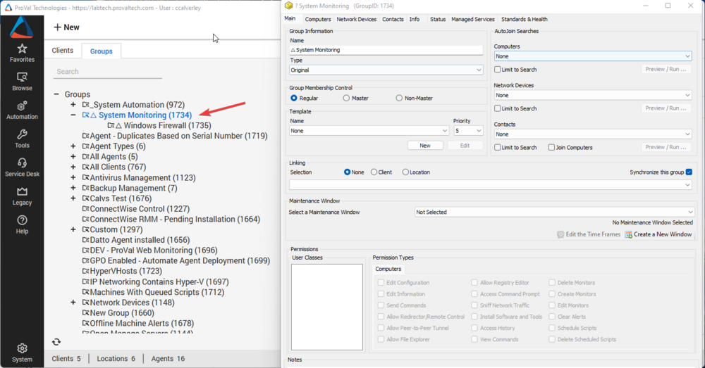

- △ Windows Firewall

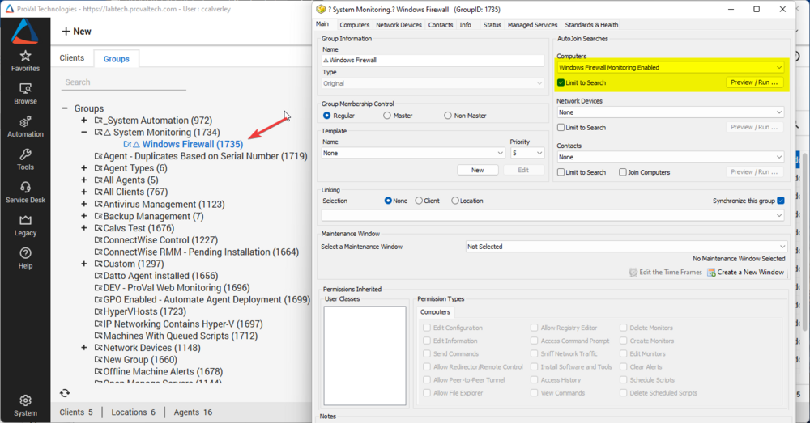

## Creates and Links the Remote Monitors

- △ Disabled Net Firewall Profile

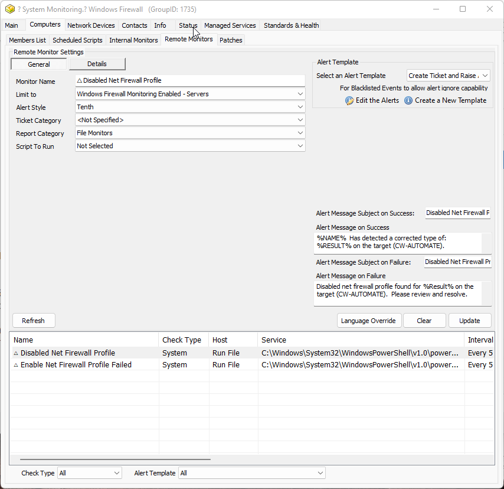
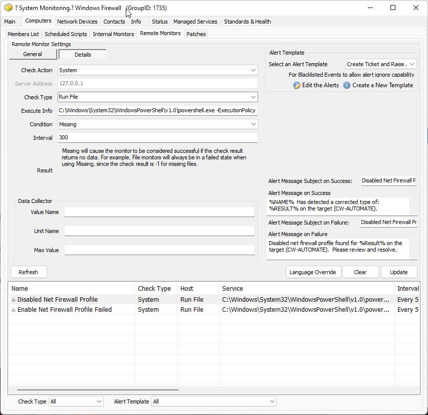

- △ Enable Net Firewall Profile Failed

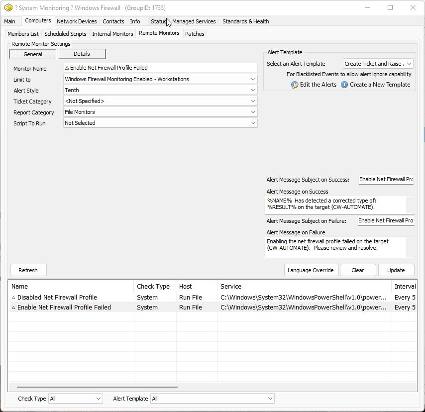
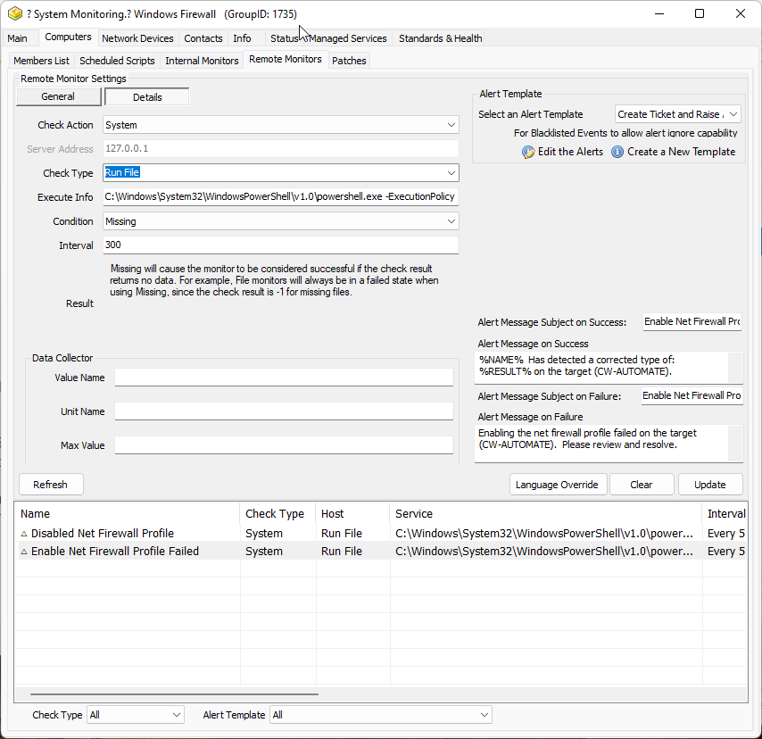

# Process (Removal)

## Remove the Remote Monitors

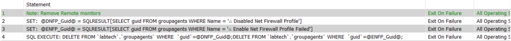

## Remove the Groups

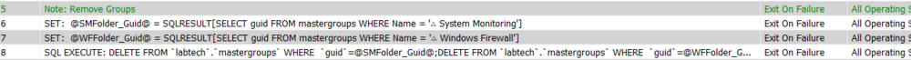

## Remove the Searches

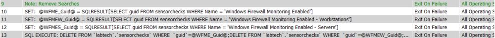

## Remove Any Filled-in Extra Data Field Data

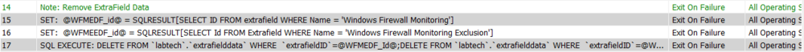

## Remove the EDFs

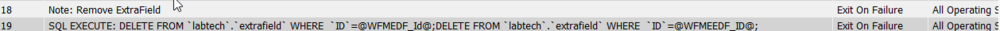

# Explanation of Solution

1. The EDFs populate the group △ Windows Firewall with computers that should be monitored and are not explicitly excluded with the computer-level EDF.
2. The remote monitor △ Disabled Net Firewall Profile is limited to the servers in the Windows Firewall Monitoring Enabled - Servers search and creates a ticket if any net firewall profile is set to disabled.
3. The remote monitor △ Enable Net Firewall Profile Failed is limited to the workstations in the Windows Firewall Monitoring Enabled - Workstations search and creates a ticket if any disabled net firewall profile is unable to be set to enabled.

Ticketing is formatted and should not autoclose, but every 10 days (a limitation of automation set to maximum) will append another failed note to any created ticket that is still open.

# Ticketing

## △ Enable Net Firewall Profile Failed

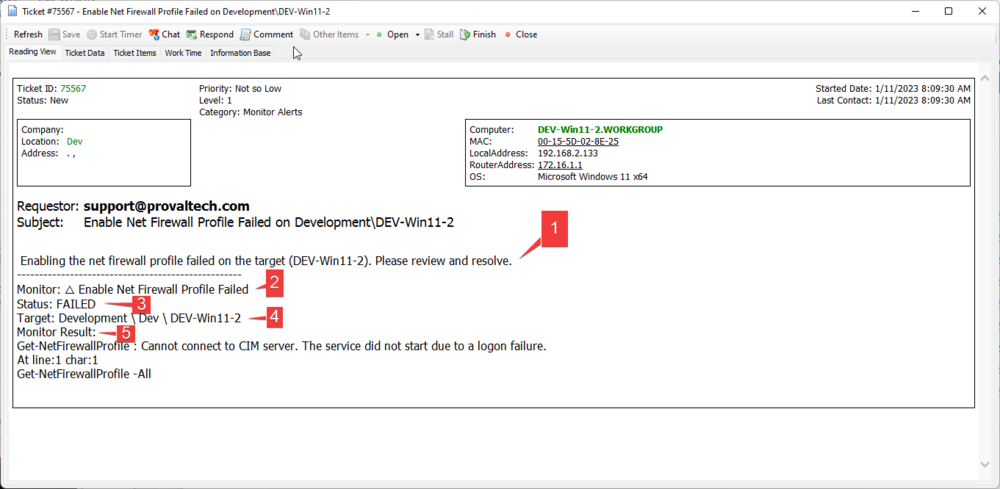

1. This line shows the actionable item that needs to be addressed.
2. This reflects the monitor that triggered this ticket.
3. This reflects the status of that monitor on the target.
4. This reflects the target of the monitor.
5. This is the returned data from the target when running the monitor. This will tell you why the target failed; in the above case, it appears that there may be a logon failure preventing this action from being taken. This error should be evaluated on the target, and any corrective action to resolve this issue should be taken.

## △ Disabled Net Firewall Profile

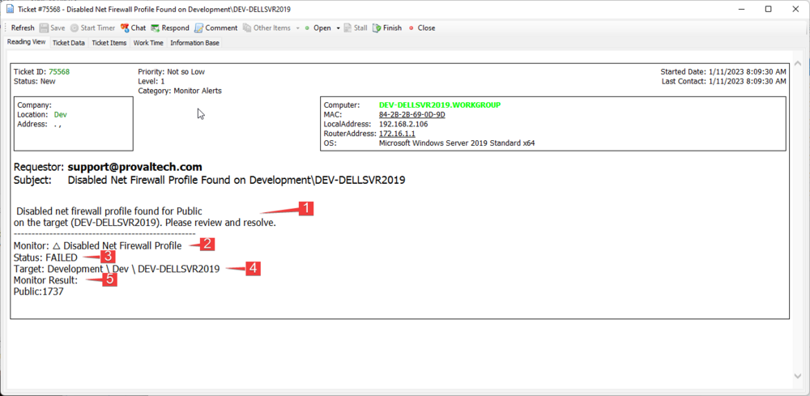

1. This line shows the actionable item that needs to be addressed. (This monitor, for some reason, is including a :1737 in the return; I believe this has something to do with a potential array being passed back in automation, and it is formatting as a new line.)
2. This reflects the monitor that triggered this ticket.
3. This reflects the status of that monitor on the target.
4. This reflects the target of the monitor.
5. This is the returned data from the target when running the monitor. This will tell you why the target failed; in this case, it is showing that the monitor failed because the public net firewall is disabled.

