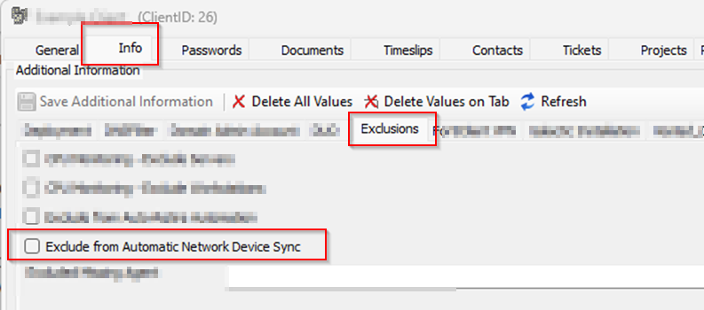
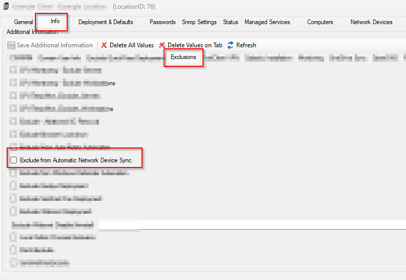
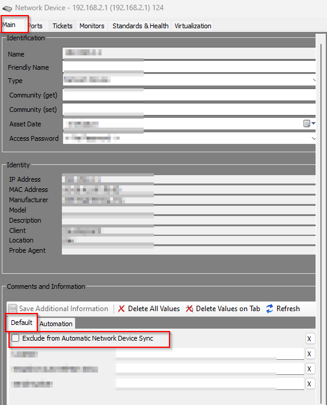
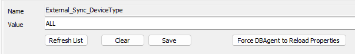
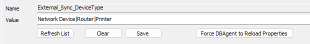
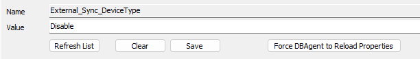
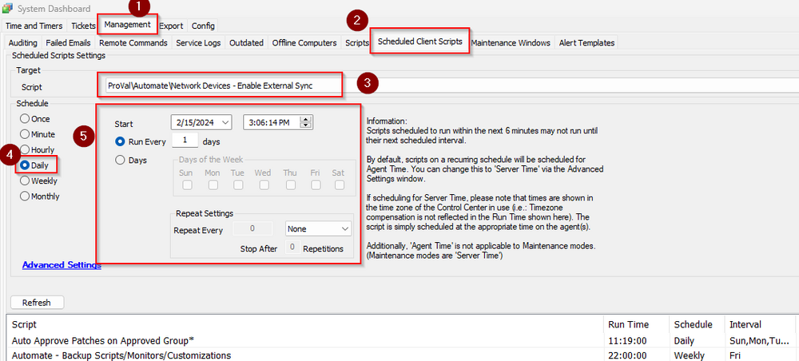

## Summary

This script ensures that the `External Sync` EDF is checked on the network devices to sync them to manage.

*Note:* Asset templates need to be properly configured for network devices in the Manage Plugin.

*Note:* Do not proceed with implementing this script if the consultant does not provide the type of network devices the partner would like to sync. Reach out to the consultant for this information.

## User Parameters

| Name               | Example | Required                                      | Description                                                                                                                                                                                                 |
|--------------------|---------|-----------------------------------------------|-------------------------------------------------------------------------------------------------------------------------------------------------------------------------------------------------------------|
| Set_Environment     | 1       | Need to set to 1 for first-time implementation | Running the script with the user parameter `Set_Environment` as `1` will import system properties and EDFs needed for the script.                                                                         |

## System Properties

| Name                          | Example                                     | Required | Description                                                                                                                                                                                                                                                                                                                                 |
|-------------------------------|---------------------------------------------|----------|---------------------------------------------------------------------------------------------------------------------------------------------------------------------------------------------------------------------------------------------------------------------------------------------------------------------------------------------|
| External_Sync_DeviceType      | 'Network Switch|Network Device|Printer|Router' | False    | The type of devices the client would like to sync to manage. If it is left blank, the script will not proceed with enabling the external sync for any network device. Separate each type with a pipe (|). Put "ALL" to sync all devices. Put "Disable" to unsync the device the script synced earlier. If left blank, the script will not proceed with enabling the external sync for any network device. |

## Extra Data Fields

| EDF Name                                   | Level  | Type     | Description                                                                                                           |
|--------------------------------------------|--------|----------|-----------------------------------------------------------------------------------------------------------------------|
| Exclude from Automatic Network Device Sync  | Client | CheckBox | Check it if you would like to disable a client from the network device's external sync                                   |
| Exclude from Automatic Network Device Sync  | Location | CheckBox | Check it if you would like to disable a location from the network device's external sync                                |
| Exclude from Automatic Network Device Sync  | Device | CheckBox | Check it if you would like to disable a device from external sync                                                   |
| Automate enabled External Sync              | Device | CheckBox | The script uses this EDF to store information about devices whose external sync is enabled by the script.                  |

Client-level EDF  

Location-level EDF  
  

Device-level EDF  

## Implementation

1. Import the script using the ProSync plugin:
   - [CWM - Automate - Script - Network Devices - Enable External Sync](<./Network Devices - Enable External Sync.md>)

2. Configure the solution as follows:
   - Navigate to Automation → Scripts within the CWA Control Center.
     - Debug the script [CWM - Automate - Script - Network Devices - Enable External Sync](<./Network Devices - Enable External Sync.md>) on any online machine with the user parameter 'Set_Environment' = 1.
     - It will create the system property required for the script.
   - Navigate to System Dashboard → Config → Properties
     - Fill in the `External_Sync_DeviceType` system property as per partner's requirements.
     - **Do not proceed with implementing this script if the consultant does not provide the type of network devices the partner wants to sync. Reach out to the consultant for this information.**
     - If the partner wants to sync all devices, put "ALL" in the `External_Sync_DeviceType` system property as shown below:  
       
     - If the partner wants to sync particular types of network devices like Router, Network Devices, Printer, fill in the system property as shown below. Separate each type with a pipe (|):  
       
     - If the partner wants to unsync the device that the script synced earlier, put "Disable" in the system property as shown below:  
       
   - Navigate to System Dashboard → Management → Scheduled Client Scripts
     - Schedule the script [CWM - Automate - Script - Network Devices - Enable External Sync](<./Network Devices - Enable External Sync.md>) to run daily.  
       
   - If the partner wants to exclude any particular device, location, or client from external sync, select the `Exclude from Automatic Network Device Sync` EDF respectively on that device, location, or client.

3. Requirements from Consultants:
   - Ask the partner the type of network devices they would like to sync.
   - Without this information, do not proceed with this script implementation.

## Output

- Script log

