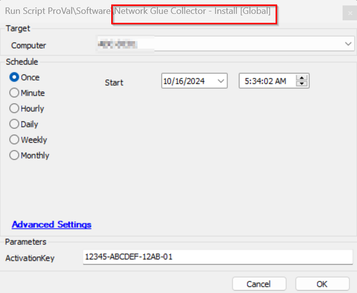

## Summary

This document provides instructions for installing the NetworkGlue Collector and applying a client-specific token. The URL is needed to download the `NetworkGlueCollector.msi`, so it is required to host the file on the ltshare or webdev. An Activation Key is necessary, and it can be found on the Clients' IT Glue page under the networks section.

## Sample Run



#### User Parameters

| Name           | Example       | Required | Description                                                                 |
|----------------|---------------|----------|-----------------------------------------------------------------------------|
| ActivationKey  | NTG1234ASDF  | True     | The individual client's activation key is found on their IT Glue Networks page |

## Global Parameters

| Name | Example | Required | Description                                                                                                           |
|------|---------|----------|-----------------------------------------------------------------------------------------------------------------------|
| URL  | [https://Your_LTSharePath/NetworkGlueCollector.msi](https://Your_LTSharePath/NetworkGlueCollector.msi) | True     | This contains the Network Glue Collector installer MSI package hosted on the ltshare, webdev, or anywhere it can be directly downloaded. |

## EDFs

| Name                           | Level   | Type  | Editable | Description                                                                                                           |
|--------------------------------|---------|-------|----------|-----------------------------------------------------------------------------------------------------------------------|
| Network Glue Activation Key     | Client  | Text  | Yes      | This is required to be set with the individual client's activation key found in their IT Glue Networks page to enable auto deployment. |
| Network Glue Deployment         | Client  | Flag  | Yes      | This checkbox at the client level is needed to allow the deployment of the Network Glue Collector to the endpoints of the client. |
| Network Glue Exclusion          | Location| Flag  | Yes      | This checkbox at the location level will exclude the deployment of the Network Glue Collector to the endpoints of the location. |
| Network Glue Exclusion          | Computer| Flag  | Yes      | This checkbox at the computer level will exclude the deployment of the Network Glue Collector from the endpoint.    |

## Process

See [SWM - Software Install - Agnostic - Install-NetworkGlueCollector](https://proval.itglue.com/DOC-5078775-9361428) for process information.

## Output

```
./Install-NetworkGlueCollector-log.txt
./Install-NetworkGlueCollector-error.txt
```

## Ticketing

***To enable ticketing, please set the ticket category in the monitor.***  


- **Subject:**  
  SW - Network Glue Collector failed to install on %computername%

- **Body:**  
  Network Glue Collector installation failed on %CLIENTNAME%//%COMPUTERNAME% at %LOCATIONNAME%. Please review the log below:  
  @ErrorLog@.


