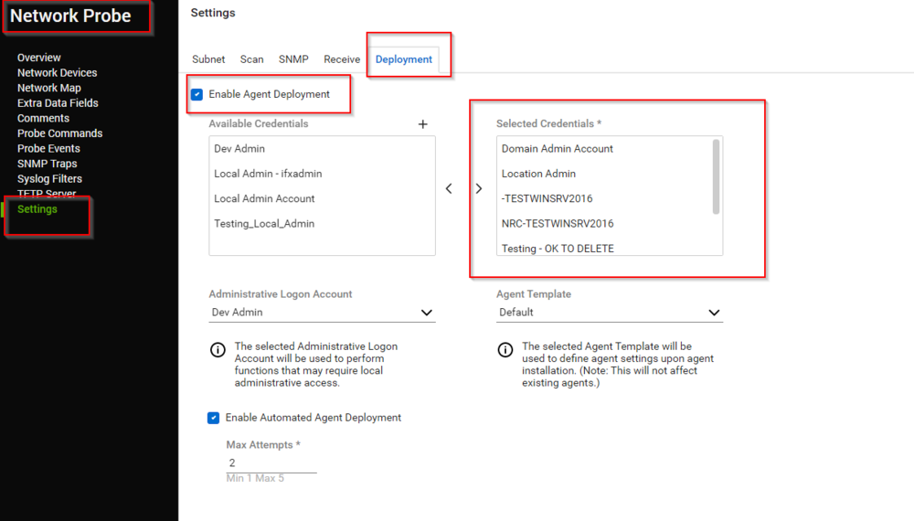
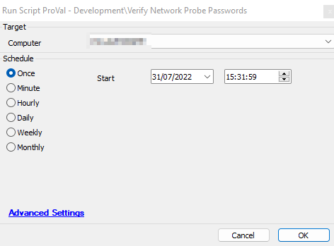
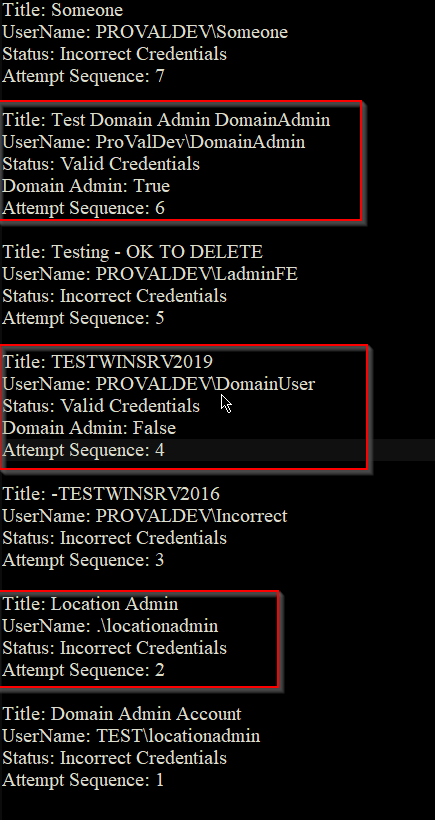

## Summary

The script determines whether the credentials given to a Network Probe for installing agents are accurate. All the credentials will be tested against the Network Probe. If a username is saved without the "//" symbol, it will be treated as a domain credential and will be checked as 'Domain/Username'.

This script can be helpful while troubleshooting agent installation issues from a Network Probe.

**Intended Target:** Network Probes with Agent Deployment Enabled

## Sample Run

## Variables

| Name                  | Description                                                                                                                                       |
|-----------------------|---------------------------------------------------------------------------------------------------------------------------------------------------|
| AutoDeploymentCheck    | (0 or 1) An SQL query updates this variable to verify whether "Enable Automated Agent Deployment" is checked for the computer.                   |
| sqldataset            | SQL data set of "Passwordid | Title | Username | Password" of all the credentials selected for agent deployment.                                 |
| Count                 | Number of credentials. Also serves as a counter for the loop.                                                                                    |
| ValidationVariable     | A variable to store and display the result of the credential verification.                                                                        |
| ParsedDomain          | Domain Name of the computer (grabbed using the PowerShell command "$env:UserDomain").                                                            |
| sqlusername           | Usernames fetched from sqldataset.                                                                                                              |
| Parsedusername        | Username without the domain name; anything occurring after the "//" symbol in the sqlusername. To be used for validation.                        |
| sqlpassword           | Password for sqlusername grabbed from sqldataset.                                                                                                |
| sqltitle              | Credential title for the sqlusername grabbed from the sqldataset.                                                                               |
| when                  | Run time of the script.                                                                                                                          |

#### Script States

| Name                                   | Example                                                                                                                                                                                                                       | Description                       |
|----------------------------------------|-------------------------------------------------------------------------------------------------------------------------------------------------------------------------------------------------------------------------------|-----------------------------------|
| Network Probe Credentials Status       | Title: SomeoneUserName: PROVALDEV/SomeoneStatus: Incorrect CredentialsAttempt Sequence: 7Title: Test Domain Admin DomainAdminUserName: ProValDev/DomainAdminStatus: Valid CredentialsDomain Admin: TrueAttempt Sequence: 6Title: Testing - OK TO DELETEUserName: PROVALDEV/LadminFEStatus: Incorrect CredentialsAttempt Sequence: 5Title: TESTWINSRV2019UserName: PROVALDEV/DomainUserStatus: Valid CredentialsDomain Admin: FalseAttempt Sequence: 4Title: -TESTWINSRV2016UserName: PROVALDEV/IncorrectStatus: Incorrect CredentialsAttempt Sequence: 3Title: Location AdminUserName: ./locationadminStatus: Incorrect CredentialsAttempt Sequence: 2Title: Domain Admin AccountUserName: TEST/locationadminStatus: Incorrect CredentialsAttempt Sequence: 1 | Final result of the script        |
| Network Probe Credentials Verification Date | 2022-07-31 06:28:01                                                                                                                                                                                                        | Run time of the script            |

## Process

1. Verify whether the computer is a Network Probe.
2. Verify whether the probe has Automated Agent Deployment enabled.
3. Fetch all passwords assigned to the probe for agent deployment.
4. Store the number of credentials in the Count variable.
5. Verify the number of credentials. The script exits if there are no credentials to check.
6. Define the variable "ValidationVariable."
7. Fetch the computer's Domain Name.
8. Initiate the loop to check the authenticity of each credential. The loop will run once per credential, i.e., Count number of times.
9. Fetch the Count number row from the %sqldataset%.
10. Check whether the stored username contains a "//" or not. If not, the credential will be considered as a domain admin and will be used as ParsedDomain/SQLusername for verification purposes.
11. Fetch the Parsedusername from the sqlusername, i.e., anything occurring after the "//" symbol in the username.
12. Run the "whoami" command with the authority of sqlusername and [sqlpassword](http://sqlpassword).
13. Verify the outcome of the command run in Step 12. If the outcome contains the Parsedusername, then the credentials are considered correct; otherwise, the credentials are considered incorrect.
14. Check if it's a domain admin for the correct credentials.
15. Write the ValidationVariable variable for the credential according to the outcome of the verification.
16. Repeat the loop for each credential (Step 8 to Step 15).
17. Store the final consolidated result in the "Network Probe Credentials Status" script state and the current time in the "Network Probe Credentials Verification Date" state.
18. Generate the information logs according to the failure or success of the script.

## Output

- Script State
- Script Logs

**Sample:**

