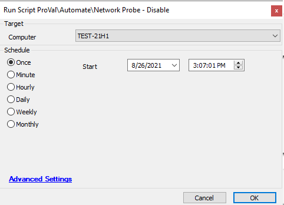

## Summary

This script will disable the Network probe on an Automate agent.  
**Time Saved by Automation:** 2 Minutes

## Sample Run

## Process

- This script runs an LT Command to disable the Network probe on the Automate agent.

