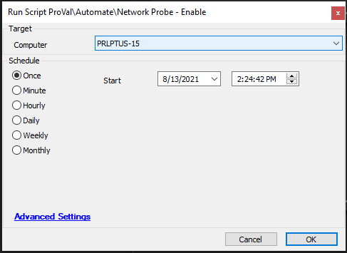

## Summary

This script executes the command to generate a network probe.

It should be used with a monitor for locations missing a network probe.

**Time Saved by Automation:** 5 Minutes

## Sample Run

The script executes the LT Command to enable the network probe.

## Output

No Output - Command Log
