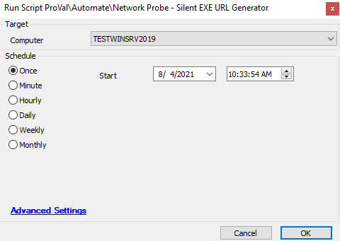

## Summary

This script is part of our GPO deployment script, but also can be run standalone. The script generates the silent installer, the same way the probe naturally would.

**Time Saved by Automation:** 5 Minutes

## Sample Run

## Dependencies

- Requires you to have a probe setup and the script **run on the probe**

## Variables

- `@LTSilentEXEURL@` = `@serveraddress@/Labtech/Deployment.aspx?%sqlresult%` --- This will be the full URL to download the silent installer
- `@serveraddress@` = `%sqlresult%` -- Setting internal variable to your default template's connection string
- `%sqlresult%` = `select substring_index(serveraddress,'|',1) from templates where templates.name = 'default'` --- This pulls in your default template's connection string.

## Process

1. The script inserts the Probe command to update the agent installer
2. Once the command completes, the script parses out the server address and the URL
3. Queries the default template connection string from the database.
4. Lastly, combines all the strings to create your silent installer URL download link.

- This would return the full URL to be used in the GPO Deployment script 

## Output

- Script log -> Logs the silent install URL to the script logs.

