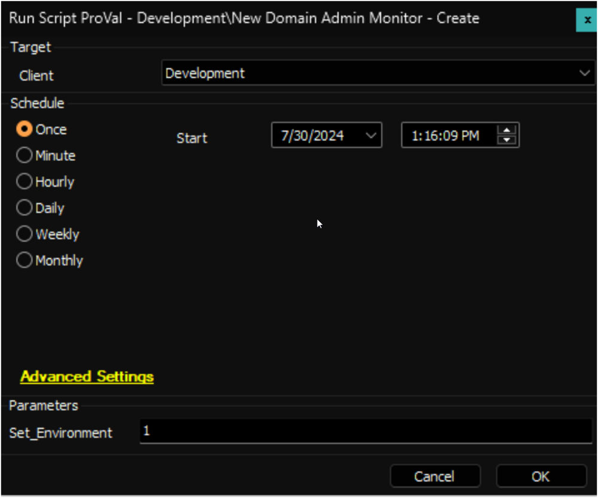
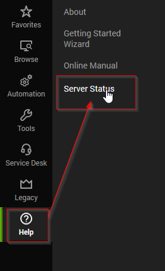
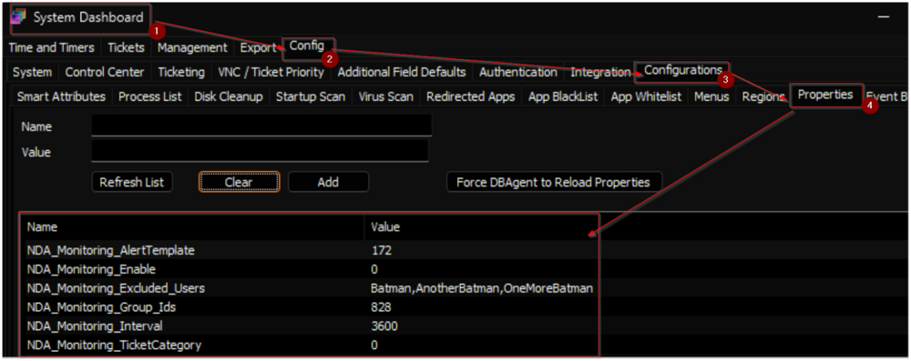
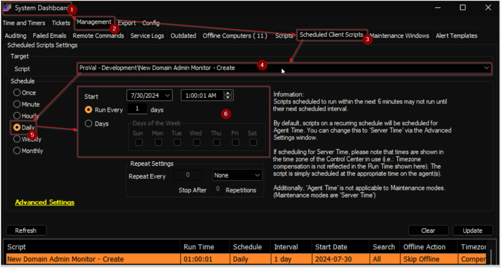
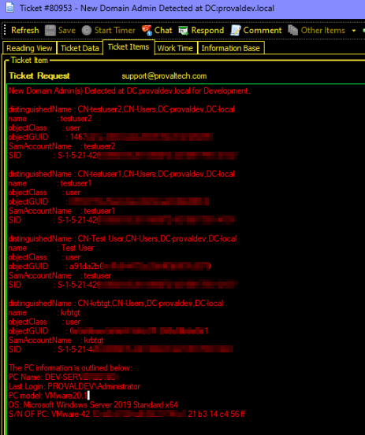
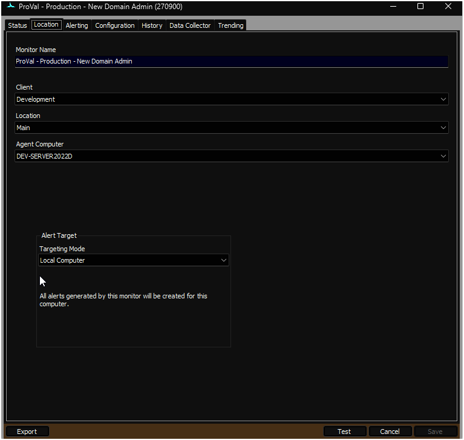
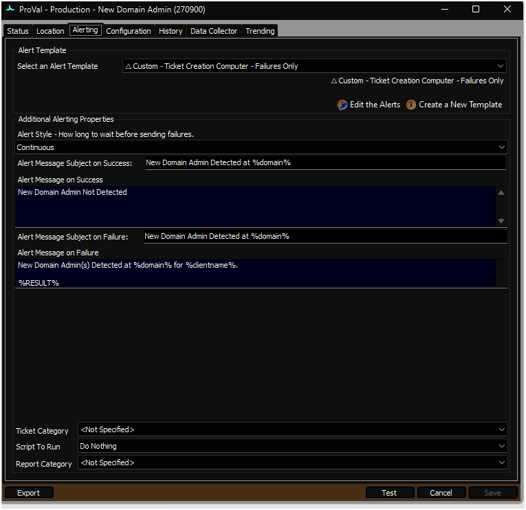
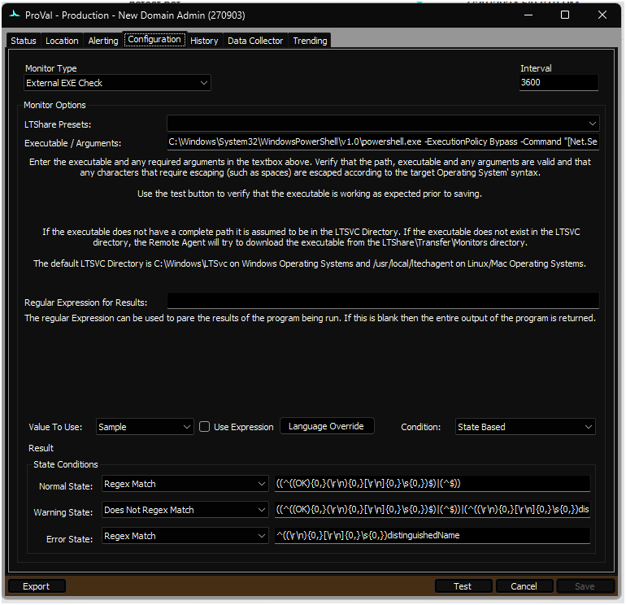

## Summary

This document describes the process for creating remote monitors to identify new or elevated domain administrators on a Windows domain controllers. The creation of these remote monitors is based on system properties, as well as client-level, location-level, and computer-level Extra Data Fields (EDFs), which are further explained in this document.

The script generates remote monitors that trigger an alert when a user or group of users are promoted as domain administrator on a Windows domain controller. By default, it excludes the domain administrators created by the [Windows Domain Admin Process](<../../solutions/Windows Domain Admin Process.md>) solution. Additionally, the system properties, detailed further in the document, can be used to exclude specific users if necessary.

The generated remote monitors `ProVal - Production - New Domain Admin` will use the [Get-NewDomainAdmin](<../../powershell/Get-NewDomainAdmin.md>) agnostic script to perform the monitoring. The monitor set will be created for one domain controller per domain to avoid any duplicate alerts/tickets from multiple domain controllers for the same user.

**File Path:** `C:/ProgramData/_Automation/Script/Get-NewDomainAdmin/Get-NewDomainadmin.ps1`  
**File Hash:** `934A0A3CD8A38BE3EA8B39C8440D8DBB7FB0833B914E197BDE6A4C9C8C27711D`  

**Note of Caution:** The remote monitors created by this script use PowerShell for monitoring. Therefore, their functionality is not guaranteed on computers running a version of PowerShell older than 5. Please ensure that your systems are updated to at least PowerShell version 5 for optimal performance.

## Update Notice: 30-August-2024

The solution's Extra Data Fields have been renamed. Update the script from the `Prosync` plugin and run/debug against any client with `Set_Environment` as `1` to implement the changes.



## Implementation

1. **Remove Existing Monitors**
   - Remove the existing `ProVal - Production - New Domain Admin` monitor set from the groups it's already applied to.
     - Execute this SQL query from a RAWSQL monitor set to get rid of the existing monitors:
       ```
       Delete From Groupagents where `Name` = 'ProVal - Production - New Domain Admin'
       ```

   - Open the `Server Status` tool by navigating to `Help` > `Server Status`.
   

   - Click the `Do Group Refresh` button to refresh and apply the changes made.
   

   - Click `OK` to the popup message and wait for a minute to allow the changes to take effect.
   

2. Import the `△ Custom - Ticket Creation - Computer - Failures Only` alert template from the `ProSync` plugin if it's missing in the environment.

3. Import the [`New Domain Admin Monitor - Create`](https://proval.itglue.com/5078775/docs/16548733) script from the `ProSync` plugin.

4. **Run/Debug the Script**
   - Execute or debug the script against a single client, with the `Set_Environment` parameter set to `1`. This action will generate the necessary system properties and Extra Data Fields (EDFs) for managing the remote monitors.
   
   

5. **Reload System Cache**
   - Refresh the system cache to ensure all changes are updated.
   

6. **Configure System Properties and EDFs**
   - Navigate to the **System Dashboard -> Config -> Configurations -> Properties**.
   - Find the properties beginning with `NDA_Monitoring`.
   
     - The consultant should have provided you with any customizations that are required. Please read through the detailed System Properties and EDF explanations to understand how to configure any customizations.

7. **Schedule the Script**
   - Schedule the script to run once per day, preferably around midnight, from the dashboard for optimal results.
   

## Dependencies

[EPM - User Management - Agnostic - Get-NewDomainAdmin](<../../powershell/Get-NewDomainAdmin.md>)

## User Parameters

| Name                | Example | Required                      | Description                                                                                                                                                       |
|---------------------|---------|-------------------------------|-------------------------------------------------------------------------------------------------------------------------------------------------------------------|
| Set_Environment      | 1       | True (for first run only)    | Set it to 1 during the first run of the script to generate the necessary system properties and EDFs for managing the generated remote monitors.                  |

## System Properties

| Name                          | Example | Required | Description                                                                                                                                                                                                                                      |
|-------------------------------|---------|----------|--------------------------------------------------------------------------------------------------------------------------------------------------------------------------------------------------------------------------------------------------|
| NDA_Monitoring_Enable         | 1       | True     | Set this system property to `1` to enable the remote monitor creation for the partner. The default value is `0`.                                                                                                                                 |
| NDA_Monitoring_Group_Ids      | 828     | True     | The script will create remote monitors for the domain controllers (One Domain Controller Per Domain) that belong to the groups identified by the group IDs specified in this system property. Multiple IDs can be included by separating them with a comma. |
| NDA_Monitoring_Interval       | 3600    | True     | Controls the generated Remote Monitor run time interval. The default is 3600 seconds.                                                                                                                                                          |
| NDA_Monitoring_AlertTemplate  | 611     | True     | This system property stores the id of the `Alert Template` to apply to the created remote monitors. The default value is the TemplateID of the `△ Custom - Ticket Creation - Computer - Failures Only` alert template.                          |
| NDA_Monitoring_TicketCategory  | 124     | False    | This system property stores the id of the `Ticket Category` to apply to the remote monitors created for the Domain Controllers. The default value is '0'. i.e., `&lt;Not Specifed&gt;`.                                 |
| NDA_Monitoring_Excluded_Users | Batman,AnotherBatman,OneMoreBatman | True | This system property stores the usernames to exclude from generating the new domain admin-detected tickets. The default value will be `&lt;blank&gt;`. Multiple usernames can be added by separating them with a comma.                |

## Client-Level EDF

| Name                                     | Type      | Section             | Description                                                                                                                                                                                                                                        |
|------------------------------------------|-----------|---------------------|----------------------------------------------------------------------------------------------------------------------------------------------------------------------------------------------------------------------------------------------------|
| 2a. Exclude from New Domain Admin Monitor | Check Box | Domain Admin Account | Selecting this Extra Data Field (EDF) will exclude the client from the New Domain Admin Monitoring. As a result, the script will not create any remote monitors for the domain controllers under this client.                                        |
| 2b. Excluded_Users                       | Check Box | Domain Admin Account | This EDF stores the usernames to exclude from generating the new domain admin-detected tickets. The value stored in this EDF will be added as an additional exclusion, along with the value stored in the `NDA_Monitoring_Excluded_Users` system property. |

## Computer-Level EDF

| Name                  | Type      | Section    | Description                                                                                                                                                                                                                                        |
|-----------------------|-----------|------------|----------------------------------------------------------------------------------------------------------------------------------------------------------------------------------------------------------------------------------------------------|
| NDAM_Exclude          | Check Box | Exclusions  | Selecting this Extra Data Field (EDF) will exclude the particular domain controller from the New Domain Admin Monitoring. As a result, the script will not create any remote monitors for the server. Furthermore, upon marking this EDF, the script will also remove any previously created remote monitor. |
| NDAM_Excluded_Users   | Check Box | Exclusions  | This EDF stores the usernames to exclude from generating the new domain admin-detected tickets. By default, it will be a blank text box. The value stored in this EDF will be added as an additional exclusion, along with the value stored in the `NDA_Monitoring_Excluded_Users` system property. |

## Remote Monitor Example

**Name:** `ProVal - Production - New Domain Admin Monitor`

**Ticket Subject:** `New Domain Admin Detected at \<DOMAIN NAME>`

**Alert Message on Failure:**  
`New Domain Admin(s) Detected at \<DOMAIN NAME> for %CLIENTNAME%.`  
`\<Newly Created Domain Admin(s)>`

**Sample Ticket:**  
  
**Automate will never close the ticket, instead, it will keep adding the new detections to the same ticket as a comment/note, unless the ticket is closed/resolved manually.**

**Sample Remote Monitor:**  
  
  
  

## Output

- Remote Monitors


