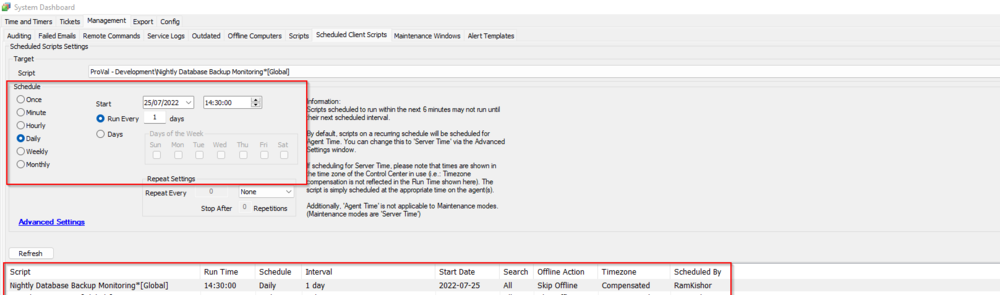

## Summary

This script will create a ticket in our (ProValtech's) Autotask Portal if the ConnectWise Automate Nightly backup fails.

## Sample Run

It is a client script and should be scheduled in the Dashboard's Offline Computer

## Variables

| Name      | Description                                               |
|-----------|-----------------------------------------------------------|
| BackupAudit | Outcome of the SQL query used to rectify the backup status |
| Subject   | Email's Subject                                          |
| Body      | Email's Body                                             |

#### System Properties

| Name                             | Default                                         | Required | Description                                                                                                                                                     |
|----------------------------------|-------------------------------------------------|----------|-----------------------------------------------------------------------------------------------------------------------------------------------------------------|
| ProVal_Alerts_Email_Address       | [Alerts@provaltech.com](mailto:Alerts@provaltech.com) | True     | By default, the system property `ProVal_Alerts_Email_Address` will get set to [alerts@provaltech.com](mailto:alerts@provaltech.com). This can be changed in the event these alerts should be going somewhere else. |

## Process

Step 1: Verifies whether the previous backup was successful or not.  
Step 2: Send an email to the address(es) saved in the Global Variable @Email@, if there's a failure in the previous database backup.

Email Subject: Nightly Database Backup Failed for %redirhostname%

Email Body:

The scheduled nightly MySQL backup for ConnectWise Automate did not appear to run. Every night a SQL backup job is supposed to create a zip file containing a backup of all of the tables for CWA. Please investigate  
**OR**  
The last nightly MySQL backup for ConnectWise Automate has failed. Every night a SQL backup job is supposed to create a zip file containing a backup of all of the tables for CWA. Please investigate  
**OR**  
A MySQL backup for ConnectWise Automate was generated last night but it is lower than 100 MB in size. Typically these backup files are greater than 1GB in size, so this generally means the backup failed. Please investigate.

## Output

- Email

