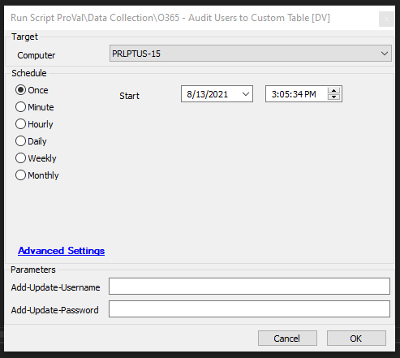

## Summary

This script uses O365 admin credentials to connect to O365 and audit users to a custom table. By default, the script saves the O365 credentials to the password tab, so subsequent runs won't require entering them again (if these fields are left blank, it will attempt to load them from the passwords tab of the client). This script is intended to be used with ProVal's Dashboard for reporting. Dataviews built to monitor this will require super admin access.

**Requirements**  
Windows OS and PowerShell 5.0 are required.

**Time Saved by Automation:** 15 Minutes

## Sample Run

## Dependencies

@O365 Users DV???

## Variables

- @Add-Update-Username@ - User Param
- @Add-Update-Password@ - User Param
- @passwordid@ - Pulls from the Passwords table
- @username@
- @password@

### User Parameters

| Name                   | Example   | Required | Description                                                  |
|------------------------|-----------|----------|--------------------------------------------------------------|
| Add-Update-Username    | User      | False    | Will add or update a stored username for O365 admin in the Passwords Tab |
| Add-Update-Password    | Password1 | False    | Will add or update a stored password for O365 admin in the Passwords Tab |

## Process

- Creates the @plugin_proval_o365_users table.
- Checks if User Params for username/password have been entered; if yes, updates the table; if no, selects the existing username/passwords in the table.
- Checks for the AzureRM PowerShell module and installs it if missing.
- Attempts to connect to O365, gathers information, and imports it into the custom table.

## Output

Script Log

