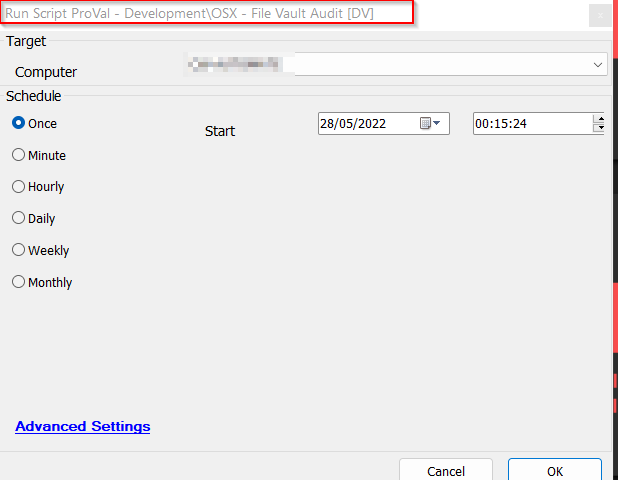

## Summary

This script gets the File Vault Status of a Mac machine and stores it to a computer level EDF, "File Vault Status".

## Sample Run

Suggested is to schedule the script to run daily against the MAC machines to keep the dataview up-to-date.

## Dependencies

[CWM - Automate - Dataview - OSX - File Vault Audit [Script]](https://proval.itglue.com/5078775/docs/10027996)

## Process

1. Executes the "fdesetup status" command to fetch the FileVault's status.
2. Update the current time to "File Vault Script Run Time" EDF.
3. Update the Outcome of the command to "File Vault Status" EDF.

## Output

- EDF

