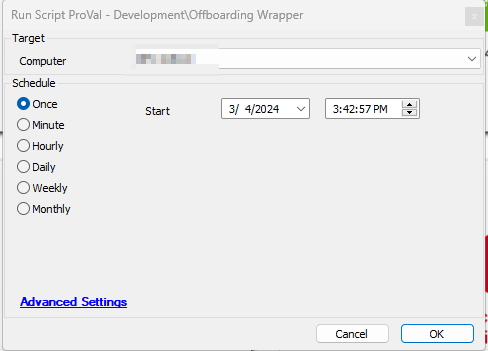
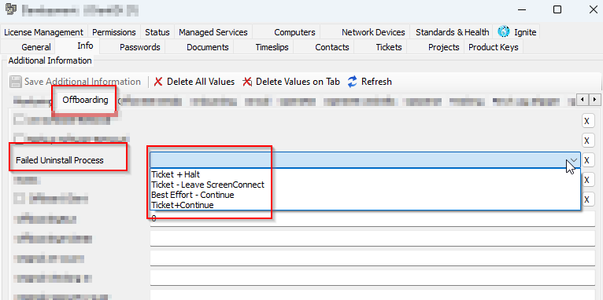
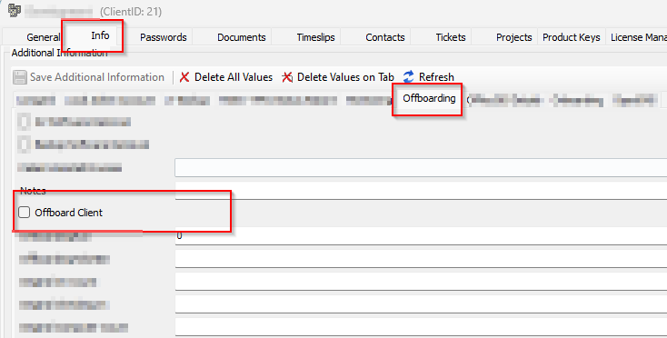
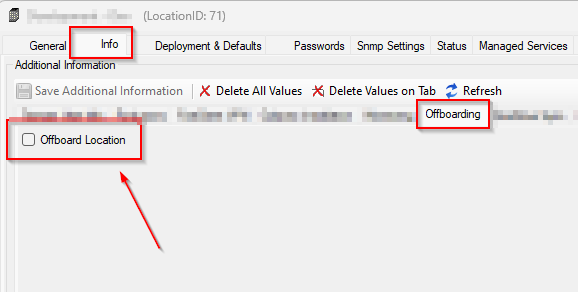
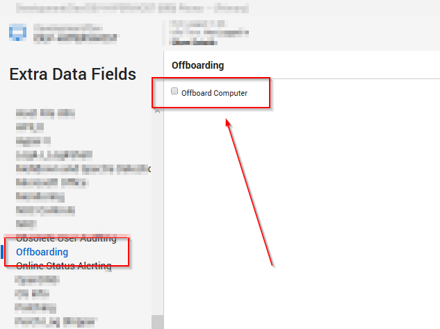

## Summary

This is a wrapper script that can be used to offboard machines from the client's environment by defining the scripts to be run before offboarding the machine. This script calls a template script "Offboarding Scripts - Partner" from which any of the subscripts that have to be run before offboarding can be run. If any of the child scripts fail to run, the parent script will not proceed for Screenconnect or Automate agent removal.

Note: All changes have to be done in [CWM - Automate - Template - Offboarding Scripts - Partner](https://proval.itglue.com/DOC-5078775-15281996) only. No alteration is required in the wrapper script.

## Dependencies

- [CWM - Automate - Template - Offboarding Scripts - Partner](https://proval.itglue.com/DOC-5078775-15281996)
- [SWM - Software Uninstall - Script - Remove Application](https://proval.itglue.com/DOC-5078775-12578871)
- [CW Control - Uninstall and Remove from Control Web Portal](https://proval.itglue.com/DOC-5078775-7770031)

## Sample Run

**

## System Properties

| Name                                   | Required | Example                      | Description                                                                                                                                                                                                                      |
|----------------------------------------|----------|------------------------------|----------------------------------------------------------------------------------------------------------------------------------------------------------------------------------------------------------------------------------|
| `_sysOffboardingAlertType`            | False    | Email, Ticket                | - Set its value 'Ticket' to enable ticketing- Set its value 'Email' to enable Emailing- Set its value 'Email, Ticket' to enable both emailing and ticketing                                                                 |
| `_sysOffboardingDefaultEmailAddress`  | False    | [xyz@something.com](mailto:xyz@something.com) | Default Email Address to send the alerts to. If nothing is mentioned in this property, the script will send the emails to the user who ran the script.**Note:** Script will only send emails if `_sysOffboardingAlertType` system property is set to email. |
| `_sysOffboardingDefaultTicketCategory`| False    | 234                          | Mention the ticket creation category in order to direct the tickets to the right board in Manage                                                                                                                              |
| `_sysOffboardingTicketOnSuccess`      | False    | 0                            | Set it to '1' to receive tickets if the script successfully removes all the required applications from the machine.                                                                                                           |
| `_sysOffboardingClientInformativeTicket` | False  | 1                            | This system property creates a client/location level whenever someone opts for Client/location offboarding using the `Offboard Client` EDF or `Offboard Location` EDF.Its default value is '1' which means the script will create a client/location ticket if it's not already created on these EDF selections.Set it to '0' to disable this client/location ticket. |

## Extra Data Fields

| EDF Name               | Level    | Type     | Description                                                                                                                                                                                                                     |
|-----------------------|----------|----------|---------------------------------------------------------------------------------------------------------------------------------------------------------------------------------------------------------------------------------|
| Failed Uninstall Process | Client  | Dropdown | This EDF has three options:- "`Ticket + Halt`" - Stop the Offboarding process if any child script fails to run. It will create tickets for failure.- "`Ticket - Leave ScreenConnect`" - Remove the screenconnect agent and create a ticket if any child script fails to run. It will not remove the Automate agent.- "`Best Effort - Continue`" - Continue for Screenconnect and Automate agent removal even though any child script fails to run. It will not create any failure tickets.- "`Ticket+Continue`" - Continue for Screenconnect and Automate agent removal even though any child script fails to run. But It will not create failure tickets.If none of these options are selected script will exit without creating any failure tickets. |
| Offboard Client       | Client   | Checkbox  | Check it to Offboard the whole client                                                                                                                                                                                         |
| Offboard Location     | Location | CheckBox  | Check it to Offboard the whole location                                                                                                                                                                                       |
| Offboard Computer     | Computer | CheckBox  | Check it to Offboard the machine.                                                                                                                                                                                            |

- Select Failed Uninstall Process from "Failed Uninstall Process" EDF  
  **

- Select "`Offboard Client`" EDF to select the whole client for offboarding  
  **

- Select "Offboard Location" EDF to select the whole location for Offboarding  
  **

- Select "Offboard Computer" EDF to select the machine for Offboarding  
  **

## Output

- Script Logs
- Ticketing

## Ticketing

**Computer Level ticketing**  
**Subject:** `Offboarding status on %ComputerName%(%ComputerID%)`

**Ticket Body:** `OffBoarding Script Ran on the machine %Computername%. Here are the script results..!!`  
`Script has successfully removed the following applications:@Success@`  
`The applications below have failed to uninstall, please look into these failures:@Failure@`  
If any application fails to uninstall, it is likely that the machine needs to be rebooted before the tools will show as removed. Please work with the end user to get the device rebooted and then we can attempt the offboarding process again. If it fails again, you will likely have to remove the last bits of software manually...sorry! Once you've removed that pesky software, please run the Offboarding script again to remove the Automate agent from the device.

**Client Level ticketing:**  
**Subject:** `Offboarding initiated on client - %ClientName%`  
`%ScriptName% has been initiated to offboard all machines of this client.`

**Location Level ticketing:**  
**Subject:** `Offboarding initiated on location - %LocationName%`  
**Ticket Body:** `It seems like "Offboard Location" EDF has been selected for %LocationName%.%ScriptName% has been initiated to offboard all machines under this location.`

