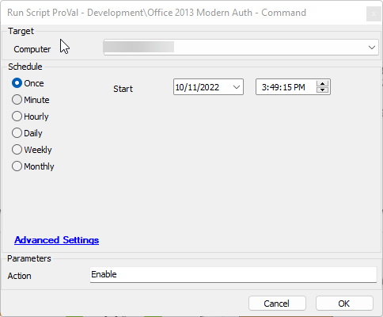
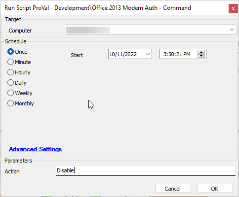

## Summary

This script will enable or disable Modern authentication for Office 2013 as per the instructions found at [Enable Modern Authentication for Office 2013 on Windows devices - Microsoft 365 admin | Microsoft Learn](https://learn.microsoft.com/en-us/microsoft-365/admin/security-and-compliance/enable-modern-authentication?view=o365-worldwide), depending on the action provided.

## Sample Run

  
Entering nothing or anything other than "Disable" will enable Modern authentication.

  
Entering "Disable" will disable Modern Authentication.

## Variables

Document the various variables in the script. Delete any section that is not relevant to your script.

| Name  | Description                                                       |
|-------|-------------------------------------------------------------------|
| psout | Holds the response from running the user registry command via the bootstrap. |

#### User Parameters

| Name    | Example                   | Required | Description                                               |
|---------|---------------------------|----------|-----------------------------------------------------------|
| Action  | anything or 'Disable'     | False    | Blank or anything other than 'Disable' will enable Modern authentication. |

## Process

1. Log the requested action (Enable or Disable).
2. Use the bootstrap to run the user-set registry built-in commands.
3. Log the results.

## Output

- Script log

