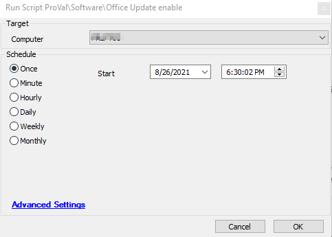

## Summary

This script enables office updates by running a PowerShell command  

Time Saved by Automation: 5 Minutes

## Sample Run

## Process

- Disables office update by running a PowerShell command which updates a registry value “HKLM://SOFTWARE//Microsoft//Office//ClickToRun//Configuration” and setting the UpdateEnabled to True.

