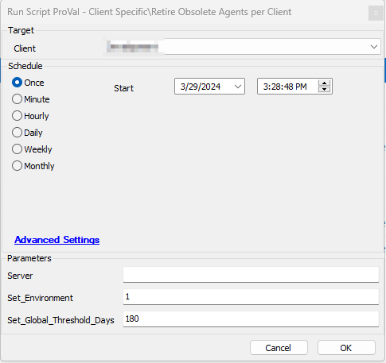
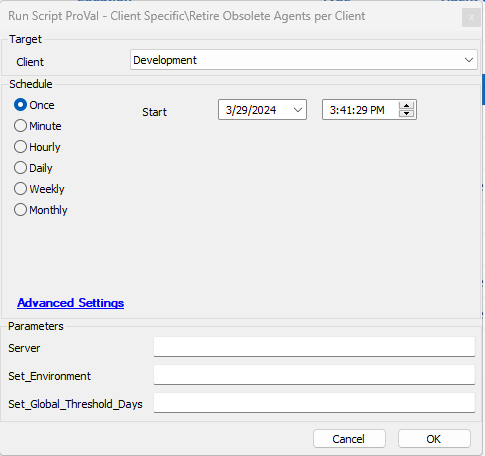
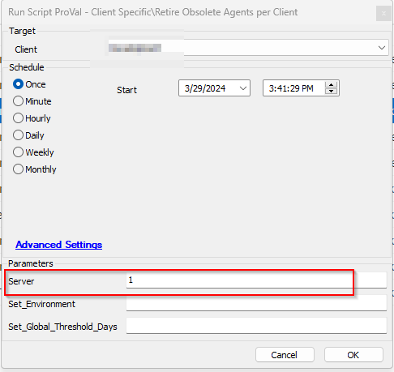
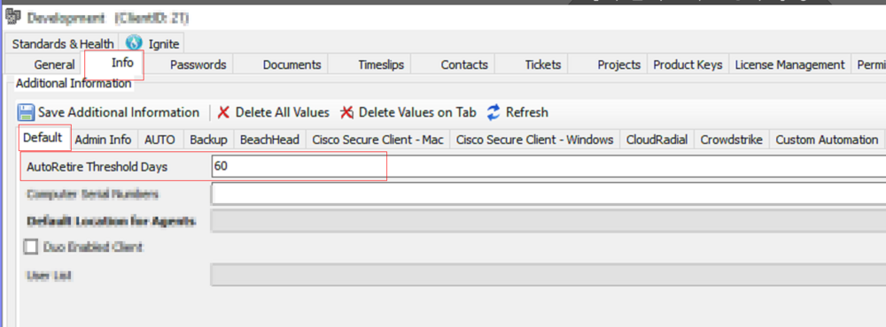
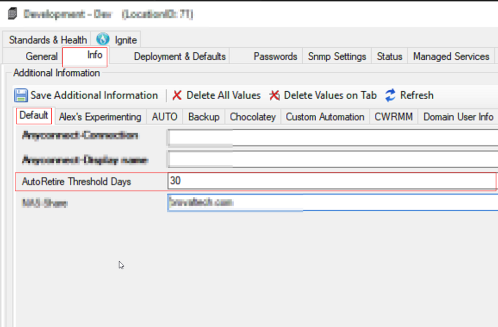
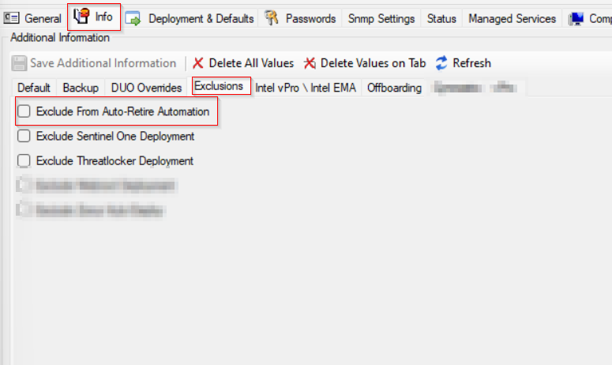
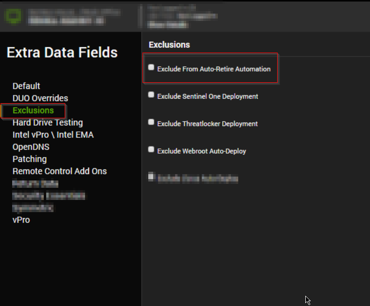
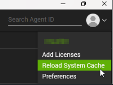

## Summary

The purpose of this script is to retire the clients agents that are offline in Automate for more than the days defined in the `Threshold` and are not `Broken` agents.

## Sample Run

For initial execution: 

Set `Set_Environment` value to 1 and Set `Set_Global_Threshold_Days` value as per clients requirement suppose it's '180' days.

Leave all parameters blank to retire just workstations

Set `Server` value to `1` to retire both workstations and servers.

**Note: Since this is a client script, it must be executed on the client.**

#### User Parameters

| Name                      | Example | Required                       | Description                                                                                                                                                                                                                                           |
|---------------------------|---------|--------------------------------|-------------------------------------------------------------------------------------------------------------------------------------------------------------------------------------------------------------------------------------------------------|
| Set_Environment           | 1       | Mandatory for the first run    | For the script's initial execution, this parameter must be used. The dependent EDFs and the system property are essential for the script to function properly. These required EDFs and System Property are created when the script is executed with this parameter set to 1. |
| Set_Global_Threshold_Days | 180     | False                          | The global property 'AutoRetireThreshold_Days' is set when the value in 'Set_Global_Threshold_Days' is set. If left empty, the global property will be set to '90'.                                                                                 |
| Server                    | 1       | False                          | Set its value to `1` if client wants to retire Servers along with workstations. <ul><li>`1` - Set its value to 1 to remove servers along with workstations</li><li>`0` - Set its value to 0 to blank to retire workstations only.</li></ul>          |

#### System Properties

| Name                      | Example | Required | Description                                                                                                                                                                                                                                           |
|---------------------------|---------|----------|-------------------------------------------------------------------------------------------------------------------------------------------------------------------------------------------------------------------------------------------------------|
| AutoRetireThreshold_Days  | 180     | True     | Threshold days to retire the offline computers. The default is 90. It can either be set during the first execution of the script or manually from the dashboard.                                                                                       |

#### Extra Data Fields

| Name                                    | Level  | Section   | Type      | Required | Description                                                                                                                                                                                                                                           |
|-----------------------------------------|--------|-----------|-----------|----------|-------------------------------------------------------------------------------------------------------------------------------------------------------------------------------------------------------------------------------------------------------|
| Exclude From Auto-Retire Automation     | Client | Exclusions | Check box | False    | Script will not generate any tickets for the client, if this EDF is checked.                                                                                                                                                                      |
| Exclude From Auto-Retire Automation     | Location | Exclusions | Check box | False    | Script will not include any computer from the location in the ticket, if this EDF is checked.                                                                                                                                                      |
| Exclude From Auto-Retire Automation     | Computer | Exclusions | Check box | False    | Script will not include the computer in the ticket, if this EDF is checked.                                                                                                                                                                        |
| AutoRetire Threshold Days                | Client | Default   | TextBox   | False    | To overwrite the threshold set in the Global Property `AutoRetireThreshold_Days` for the client.                                                                                                                                                  |
| AutoRetire Threshold Days                | Location | Default   | TextBox   | False    | To overwrite the threshold set in the Global Property `AutoRetireThreshold_Days` and Client-Level EDF `AutoRetire Threshold Days` for the location.                                                                                                  |

**Following EDFs can be used to overwrite the Threshold Days defined in the System property `AutoRetireThreshold_Days`:**

Client-Level EDF: "AutoRetire Threshold Days"

Location-Level EDF: "AutoRetireThreshold_Days"

**Following EDFs can be used to exclude a client/location/computer from retirement:**

Client-Level EDF: "Exclude From Auto-Retire Automation"

Location-Level EDF: "Exclude From Auto-Retire Automation"

Computer-Level EDF: "Exclude From Auto-Retire Automation"

## Implementation

1. Import the script using ProSync Plugin

2. Reload the System Cache

3. Configure the script as follows:
   - Navigate to Automation --> Scripts within the CWA Control Center and open the script
   - Debug the script against any client with the `Set_Environment` parameter set to 1 and `Set_Global_Threshold_Days` set to the number of days for global property `AutoRetireThreshold_Days`.
     - Validate the system property was set correctly by navigating to System --> Configuration --> Dashboard --> Config --> Configurations --> Properties --> Check the property 'AutoRetireThreshold_Days'
   - Run the script against the desired client.

