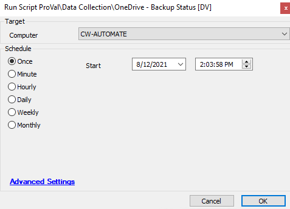

## Summary

This script gathers information about the status of the built-in OneDrive backup functionality for the currently logged-in user.

**Time Saved by Automation:** 10 Minutes

## Sample Run

## Dependencies

- [OneDrive - Backup Status](https://proval.itglue.com/DOC-5078775-8028415)  
- [EPM - Windows Configuration - Custom Table - plugin_proval_onedrivebackupstatus](<../tables/plugin_proval_onedrivebackupstatus.md>)

## Output

- Script log
- Custom table
- Dataview

