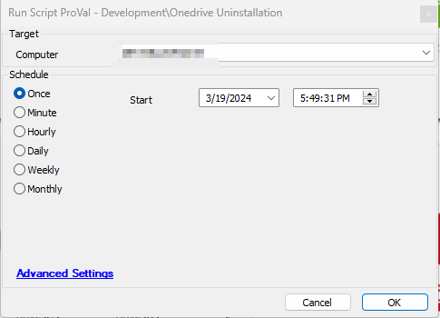

## Summary

The purpose of this script is to uninstall OneDrive from Windows machines.

## Sample Run

## Global Parameters

| Name                    | Required | Example | Description                                                                                                 |
|-------------------------|----------|---------|-------------------------------------------------------------------------------------------------------------|
| Ticket_On_Failure       | False    | 1       | Set to '1' if you would like to receive a ticket on failure; otherwise, leave it blank or set to '0'.      |
| TicketCreationCategory   | False    | 298     | Specify the ticket creation category to direct the tickets to the appropriate board in Manage.              |

## Output

- Script Logs
- Ticketing

## Ticketing

**Subject:** `OneDrive Uninstallation Failed on %ComputerName% (%ComputerID%)`

**Ticket Body:** `Failed to uninstall OneDrive on the machine. Here are the uninstallation attempt results: @Output@`

The PC information is outlined below:  
**PC Name:** %computername%  
**Last Login:** %lastuser%  
**PC Model:** @biosname@  
**OS:** %os%  
**S/N OF PC:** @biosver@

