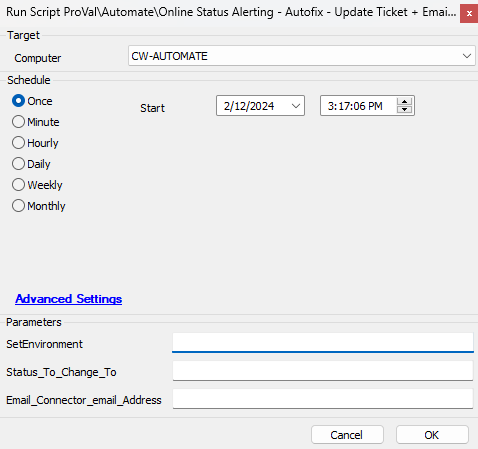

## Summary

This script will run as an auto-fix for the [Online Status Alerting - Machine Back Online](<../monitors/Online Status Alerting - Machine Back Online.md>) and [Online Status Alerting - Machine Restarted](<../monitors/Online Status Alerting - Machine Restarted.md>) monitor sets. This uses system properties `Email_Connector_email_Address` and `Status_To_Change_To` for the email connector email address and the ticket status to which the client wants to change the status.

It will change the status of the ticket if the EDF "Online Alert Ticket ID" at the computer level is filled with Ticket ID or Email ID is filled in the EDF "Online Alert E-mail". It will change the status along with a message. One can also provide a reason why they want to be notified by filling in the reason in the EDF "Online Alert Reason".

Additionally, filling out the "Online Alert Scripts" will run a list of scripts after the machine comes back online.

## Sample Run

The script is designed to run from the [Online Status Alerting - Machine Back Online](<../monitors/Online Status Alerting - Machine Back Online.md>) and [Online Status Alerting - Machine Restarted](<../monitors/Online Status Alerting - Machine Restarted.md>) monitor sets only and should not be executed manually against any machine except for the first time to set the environment.

After importing the script it should either be debugged or run against any computer in the environment with 1 in the user parameter `SetEnvironment` along with other user parameters `Email_Connector_email_Address` and `Status_To_Change_To`.

**NOTE:** The user parameters `Email_Connector_email_Address` and `Status_To_Change_To` are required to be filled only by running the script for the first time after importing it. This sets the system properties on its first run.

## Dependencies

- [CWM - Automate - Script - Online Status Alerting - Update EDFs [Param]](<./Online Status Alerting - Update EDFs Param.md>)

### System Properties

- `Status_To_Change_To`: The ticket status client wants to change to.
- `Email_Connector_email_Address`: Email address of email connector.

## User Parameter

| Parameter Name                     | Example                | Required                    | Description                                                                                                                                          |
|------------------------------------|------------------------|-----------------------------|------------------------------------------------------------------------------------------------------------------------------------------------------|
| `SetEnvironment`                   | 1                      | True for first run only     | Set it to 1 for the first run after importing the script. This will create the System Properties needed for the solution.                          |
| `Email_Connector_email_Address`    | [abc@xyz.com](mailto:abc@xyz.com) | True for first run only     | Email address of email connector. This will help to link the email system with ticketing. THIS SHOULD BE USED ONLY WITH SetEnvironment = 1.       |
| `Status_To_Change_To`              | Requeued               | True for first run only     | The ticket status client wants to change to. THIS SHOULD BE USED ONLY WITH SetEnvironment = 1.                                                      |

## Variables

| Name                             | Description                                                                                                           |
|----------------------------------|-----------------------------------------------------------------------------------------------------------------------|
| `Subject`                        | Email Subject                                                                                                         |
| `Body`                           | Email Content                                                                                                         |
| `TicketID`                       | Ticket ID specified in the Computer EDF "Online Alert Ticket ID" for which the one wants to change the status in Manage. |
| `Reason`                         | Reason specified in the Computer EDF "Online Alert Reason"                                                           |
| `Email`                          | Email ID for the recipient who wants to be notified via email if the machine comes back online.                      |
| `ScriptIDs`                      | The scripts to run against the machine after it comes back online.                                                  |
| `Email_Connector_email_Address`  | Email address of email connector.                                                                                   |
| `Status_To_Change_To`           | The ticket status client wants to change to.                                                                         |

## Script States

| State                             | Example | Required | Description                                                                                                           |
|-----------------------------------|---------|----------|-----------------------------------------------------------------------------------------------------------------------|
| `Restarted_Machine_Notification_Uptime` | 4846    | True     | Stores the current uptime of the computer for the machines with the `Online Alert Restarted Machine` flagged.        |

## Output

- Email
- Ticket Status change to desired status as per configuration done in system property "Status_To_Change_To".

