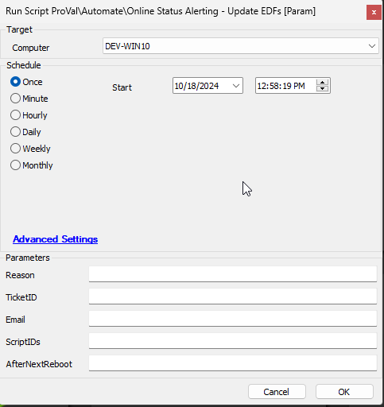

## Summary

This script can be used to provide input to the following computer EDFs:

- Online Alert Reason
- Online Alert Ticket ID
- Online Alert E-mail
- Online Alert Scripts
- Online Alert Restarted Machine (This EDF can be flagged for online machines only)

Run this script manually against the offline computer for which you want to receive a notification and change the ticket status.

## Sample Run

#### User Parameters

| Name            | Example                                        | Required | Description                                                                                                           |
|-----------------|------------------------------------------------|----------|-----------------------------------------------------------------------------------------------------------------------|
| Reason          | computer was stolen                             | False    | The reason specified in the Computer EDF "Online Alert Reason"                                                      |
| TicketID        | 1598528                                        | Semi     | Ticket ID specified in the Computer EDF "Online Alert Ticket ID" for which the status needs to be changed in Manage. |
| Email           | someone.something.com;someoneelse.something.com | Semi     | Email ID for the recipient who wants to be notified via email if the machine comes back online. Multiple email addresses can be added by separating them with a semi-colon ';' without any space. Example: `someone.something.com;someoneelse.something.com` |
| ScriptIDs       | 1567, 597                                     | False    | A comma-separated list of script IDs to run against the machine when it comes back online.                          |
| AfterNextReboot | 1                                              | False    | Set this to `1` to flag the `Online Alert Restarted Machine` EDF for the online computer. Notification will be sent after the next restart of the machine after marking this EDF. |

## Process

The parameters provided will be filled into their respective EDF values:

| Parameter       | EDF                        |
|-----------------|---------------------------|
| Reason          | Online Alert Reason        |
| TicketID        | Online Alert Ticket ID     |
| Email           | Online Alert E-mail        |
| ScriptIDs       | Online Alert Scripts       |
| AfterNextReboot | Online Alert Restarted Machine |
