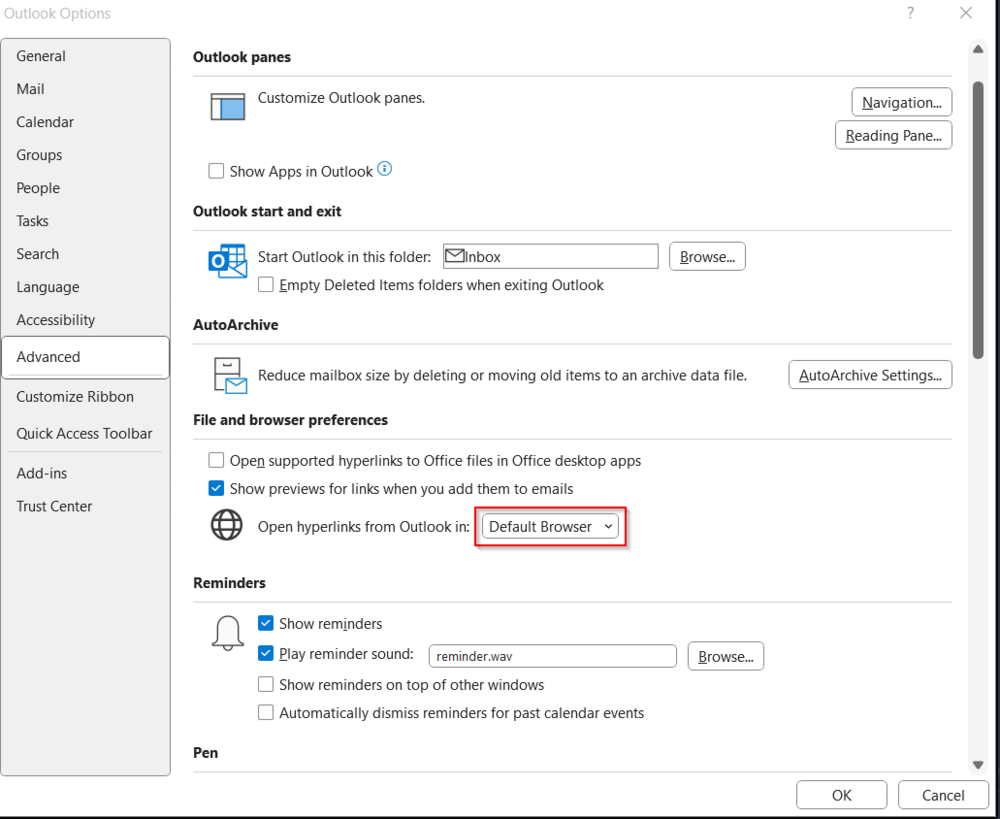
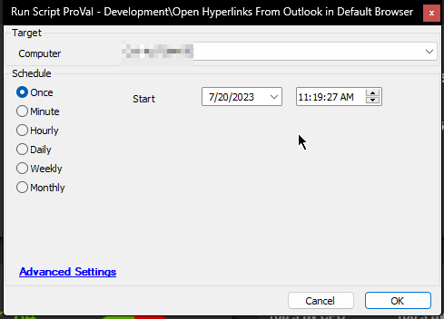

## Summary

The purpose of the script is to update the Outlook options on the computer to open hyperlinks in the **Default Browser**.

To achieve this, the script likely modifies specific values in the Windows registry related to Outlook settings, particularly those pertaining to hyperlink behavior. By setting the appropriate registry keys, the script ensures that when users click on hyperlinks within Outlook, the links will open using the **Default Browser** instead of **Microsoft Edge**.

## Sample Run

## Variables

| Name              | Description                                                                                      |
|-------------------|--------------------------------------------------------------------------------------------------|
| ProjectName       | Set-OutLookHyperLinkBehaviour                                                                    |
| WorkingDirectory   | C:/ProgramData/_automation/script/Set-OutLookHyperLinkBehaviour                                 |
| PS1Log            | C:/ProgramData/_automation/script/Set-OutLookHyperLinkBehaviour/Set-OutLookHyperLinkBehaviour-log.txt |

## Output

- Script Logs
