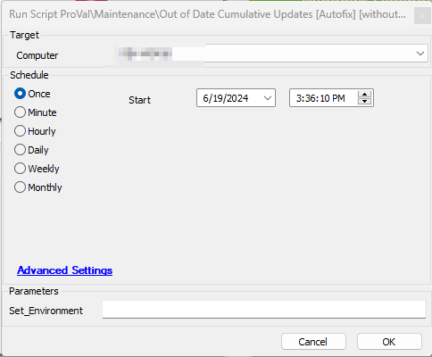
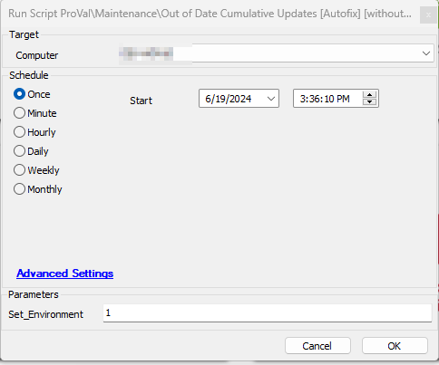

## Summary

This Autofix script is designed to initiate the installation of the latest available Cumulative Update on computers identified by the [CWM - Automate - Internal Monitor - Last Cumulative Update > 45 Days and < 60 Days](<../monitors/Last Cumulative Update 45 Days and 60 Days.md>). The script includes basic troubleshooting steps to ensure a smooth patch installation process. Essentially, this script is a version of the [CWM - Automate - Script - Out of Date Cumulative Updates [Autofix]](<./Out of Date Cumulative Updates Autofix.md>) script. It is designed to fix issues on machines before creating any tickets, thereby limiting the number of tickets generated by the [CWM - Automate - Script - Out of Date Cumulative Updates [Autofix]](<./Out of Date Cumulative Updates Autofix.md>) script.

## Sample Run

This Autofix script is intended for implementation through the [CWM - Automate - Internal Monitor - Last Cumulative Update > 45 Days and < 60 Days](<../monitors/Last Cumulative Update 45 Days and 60 Days.md>) monitor set, using the `△ Custom - Autofix - Out Of Date Cumulative Updates without Ticketing` alert template. However, it can also be manually executed simultaneously.

## Implementation

- Import the script from the `ProSync Client` plugin.
- During the initial execution, run the script against a Windows computer with the script parameter `Set_Environment` configured as `1`. This action will import the necessary System Properties required for solution management.  
  
- Configure the necessary values within the system properties, as elaborated in the System Properties section of the document.

## Dependencies

- [EPM - Windows Update - Script - Get Latest Installed Cumulative Update](https://proval.itglue.com/DOC-5078775-12849478)
- [CWM - Automate - Internal Monitor - Patches Not Installing > 60 Days](<../monitors/Last Cumulative Update 75 Days ago.md>)
- [EPM - Windows Configuration - Solution - User Prompt for Reboot](<../../solutions/User Prompt for Reboot.md>)
- [SEC - Windows Update - Agnostic - Repair-WindowsUpdate](<../../powershell/Repair-WindowsUpdate.md>)

## System Properties

| Name                                   | Default | Required | Description                                                                                              |
|----------------------------------------|---------|----------|----------------------------------------------------------------------------------------------------------|
| Out_of_Date_CU-Autofix_for_Servers    | 0       | False    | Assign a value of 1 to enable Autofix for servers; by default, the script will only generate a ticket for servers. |

## Script States

| Name                     | Example     | Description                                                                                                                                                                                                                          |
|--------------------------|-------------|--------------------------------------------------------------------------------------------------------------------------------------------------------------------------------------------------------------------------------------|
| Out_of_Date_CU_Stage    | Validation  | To monitor the progress of the validation on the computer, the Script state is also utilized in the [Internal Monitor - Last Cumulative Update > 75 Days ago](<../monitors/Last Cumulative Update 75 Days ago.md>) monitor set. This helps prevent duplicate executions of the script for the same computers. |

## Output

- Script Log

