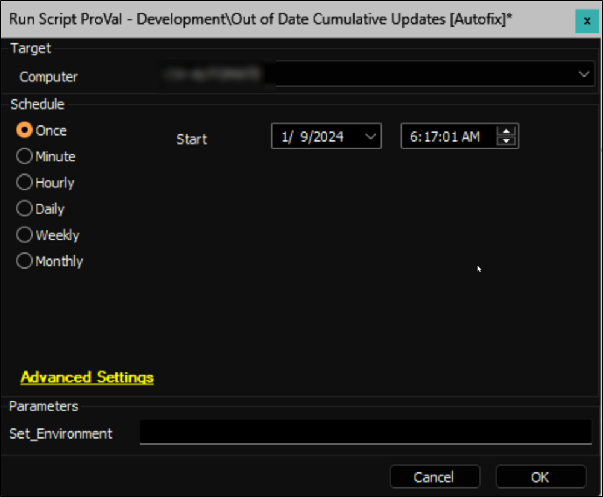

## Summary

This Autofix script is designed to initiate the installation of the latest available Cumulative Update on computers identified by the [Internal Monitor - Last Cumulative Update > X Days ago](<../monitors/Last Cumulative Update X Days ago.md>). The script includes basic troubleshooting steps to ensure a smooth patch installation process.

Here's an overview of the script's functionalities:

1. The script generates an initial ticket, conducts fundamental troubleshooting for initial patching, validates patch manager WUA settings, attempts to install the most recent Cumulative Update, and logs the outcome in the ticket.
2. If the computer goes offline while the script attempts to install the latest available Cumulative Update and the PowerShell script fails, the Autofix script will automatically reschedule itself to run again after 4 hours.
3. If successful, the ticket is closed; otherwise, a failure comment is added.
4. The `Out_of_Date_CU-Autofix_for_Servers` system property can extend the Autofix section to servers if set to `1`.
5. The script does not force a computer to restart but recommends it. For environments with the [Solution - User Prompt for Reboot](<../../solutions/User Prompt for Reboot.md>), it marks the `Pending Reboot` EDF to prompt users for a restart and closes the initial ticket upon successful reboot.
6. If the solution is not in place, the script adds a comment in the initial ticket to prompt a restart at the earliest convenience.
7. The script tracks post-reboot installations, rescheduling itself every 12 hours to monitor system uptime. If a Cumulative Update is installed within X days (Configured in `Out_of_Date_CU-Autofix_Threshold` system property), it closes the ticket; otherwise, it adds a failure comment or creates a new ticket.
8. The script handles offline machines, rescheduling itself based on offline duration (4 hours, 12 hours, or terminating after 30 days).
9. It accommodates machines in maintenance mode, rescheduling an hour after the maintenance window ends or terminating future schedules if the maintenance mode lasts more than 30 days.
10. Optionally, email alerts can be enabled by setting the value of the system property `Out_of_Date_CU-EmailAlerts` to `1`.
11. `Out_of_Date_CU-Autofix_for_Workstations` system property determines whether Autofix should be applied to workstations. Setting it to `1` will disable Autofix for workstations.
12. `Out_of_Date_CU-Autofix_Threshold` system property Specifies the threshold (in days) for identifying outdated cumulative updates, replacing the previously hardcoded 75-day limit.

This script comprehensively manages Cumulative Update installations, ensuring efficient handling of various scenarios, including offline status, maintenance mode, and appropriate alerts for non-integrated partners.

## Bug Fix: 04/19/2024

The script has been adjusted to specifically target the installation of Cumulative Updates from the monthly channel. Previously, it was picking up other Cumulative Updates, such as those for SQL and Exchange.

## Sample Run

This Autofix script is intended for implementation through the [CWM - Automate - Internal Monitor - Patches Not Installing > X Days](<../monitors/Last Cumulative Update X Days ago.md>) monitor set, using the `△ Custom - Autofix - Out Of Date Cumulative Updates` alert template. However, it can also be manually executed simultaneously.



## Implementation

- Import the script from the `ProSync Client` plugin.
- During the initial execution, run the script against a Windows computer with the script parameter `Set_Environment` configured as `1`. This action will import the necessary system properties required for solution management.

  

- Configure the necessary values within the system properties, as elaborated in the System Properties section of the document.

## Dependencies

- [EPM - Windows Update - Script - Get Latest Installed Cumulative Update](<./Get Latest Installed Cumulative Update.md>)
- [CWM - Automate - Internal Monitor - Patches Not Installing > X Days](<../monitors/Last Cumulative Update X Days ago.md>)
- [EPM - Windows Configuration - Solution - User Prompt for Reboot](<../../solutions/User Prompt for Reboot.md>)
- [SEC - Windows Update - Agnostic - Repair-WindowsUpdate](<../../powershell/Repair-WindowsUpdate.md>)

## System Properties

| Name                                     | Default | Required | Description                                                                                      |
|------------------------------------------|---------|----------|--------------------------------------------------------------------------------------------------|
| Out_of_Date_CU-EmailAlerts               | 0       | False    | Configure it to 1 to activate email alerts in conjunction with the tickets.                     |
| Out_of_Date_CU-Autofix_for_Servers      | 0       | False    | Assign a value of 1 to enable Autofix for servers; by default, the script will only generate a ticket for servers. |
| Out_of_Date_CU-Autofix_for_Workstations     | 0       | False    | Assign a value of 1 to disable Autofix for workstations |
| Out_of_Date_CU-Autofix_Threshold    | 75      | False    | Specify the threshold (in days) for identifying outdated cumulative updates |

## Script States

| Name                | Example     | Description                                                                                                                                                                                                                                                                     |
|---------------------|-------------|---------------------------------------------------------------------------------------------------------------------------------------------------------------------------------------------------------------------------------------------------------------------------------|
| Out_of_Date_CU_Stage | Validation | To monitor the progress of the validation on the computer, the script state is also utilized in the [Internal Monitor - Last Cumulative Update > X Days ago](<../monitors/Last Cumulative Update X Days ago.md>) monitor set. This helps prevent duplicate executions of the script for the same computers. |

## Output

- Script Log
- Ticket
- Email (if enabled)

## Ticketing

**Subject:**  `UPDATES - <Days Since the Latest Installed CU was Released>+ Days Since Last CU Installed on <Computer Name>`

**Example:**  `UPDATES - 90+ Days Since Last CU Installed on DEV-Win10-1`

**Possible Ticket Summary/Comment:**

**Initial Summary/Comment for the servers when Autofix is disabled:**

```
The machine %COMPUTERNAME% is currently reporting it is on the OS Build: @OSBuild@, which indicates the machine is running the @MoYr@ Cumulative update. While other patches may have been installed, the Cumulative update is by far the most important.
The WUA Settings validation has been performed too. The results are:
@ScriptResult@
The last update(s) seen to have been installed are as follows:
- OSBuild: @OSBuild@
- Cumulative Update (CU): @CU@
The Autofix feature is turned off for servers. Please manually verify the machine.
```

**Initial Summary/Comment for all machines when Autofix is enabled for the servers as well:**

```
The machine %COMPUTERNAME% is currently reporting it is on the OS Build: @OSBuild@, which indicates the machine is running the @MoYr@ Cumulative update. While other patches may have been installed, the Cumulative update is by far the most important.
The WUA Settings validation has been performed too. The results are:
@ScriptResult@
The last update(s) seen to have been installed are as follows:
- OSBuild: @OSBuild@
- Cumulative Update (CU): @CU@
Post Autofix Attempt Comment: 
@Reason@
```

**After attempting to install the Cumulative Update:**

**If CU is not detected on the computer:**
```
Automate tried to conduct basic troubleshooting, but it still doesn't display any Cumulative Update for installation. The most recent CU installed on the machine was @CU@.
The WUA Settings validation has been performed too. The results are:
@ScriptResult@
Please manually inspect the computer.
```

**If CU installation fails for some reason:**
```
Automated troubleshooting was initiated in an attempt to install the latest Cumulative Update (@AvailableCU@) for the computer. However, the installation process failed.
Output of the installation command:
@CUInstallResult@
The WUA Settings validation has been performed too. The results are:
@ScriptResult@
Manual inspection of the computer is required to address the issue.
```

**If CU is successfully installed but the [User Prompt for Reboot](<../../solutions/User Prompt for Reboot.md>) solution is not configured:**
```
The computer has successfully received and installed the latest Cumulative Update (@AvailableCU@) through the automated process. However, it's essential to be aware that the Automate environment currently does not have the `Reboot Pending [Prompt]` solution installed (<../../solutions/User Prompt for Reboot.md>). To ensure the finalization of the Cumulative Update installation, it is advised to manually restart the computer at your earliest convenience.
The WUA Settings validation has been performed too. The results are:
@ScriptResult@
Automate will actively monitor the machine and will send an email alert if the patch installation does not complete successfully after the computer restarts. This monitoring will persist for a period of 30 days, after which it will automatically cease. Therefore, it is crucial to restart the computer within this timeframe to guarantee the proper completion of the update process.
```

**The ticket will be finished if the CU is successfully installed, and the environment has the [User Prompt for Reboot](<../../solutions/User Prompt for Reboot.md>) solution configured:**
```
The server has successfully received and installed the latest Cumulative Update (@AvailableCU@) through the automated process. To ensure the finalization of the Cumulative Update installation, it is advised to restart the server at your earliest convenience.
The WUA Settings validation has been performed too. The results are:
@ScriptResult@
Automate will actively monitor the machine and will send an email alert if the patch installation does not complete successfully after the computer restarts. This monitoring will persist for a period of 30 days, after which it will automatically cease. Therefore, it is crucial to restart the server within this timeframe to guarantee the proper completion of the update process.
```

**Validation Stage:**

If the initial ticket was closed, a new ticket will be generated for the failure; otherwise, a comment will be appended to the existing ticket:

**Subject:**  `UPDATES - <Days Since the Latest Installed CU was Released>+ Days Since Last CU Installed on <Computer Name>`

**Failed to deploy the Cumulative Update:**
```
The machine %COMPUTERNAME% is currently reporting it is on the OS Build: @OSBuild@, which indicates the machine is running the @MoYr@ Cumulative update. While other patches may have been installed, the Cumulative update is by far the most important.
The WUA Settings validation has been performed too. The results are:
@ScriptResult@
The last update(s) seen to have been installed are as follows:
- OSBuild: @OSBuild@
- Cumulative Update (CU): @CU@
Despite a post-Cumulative Update installation restart, the computer still lacks the latest available Cumulative Update. Please conduct a manual check on the computer.
```

**Ticket Finish Comment for Successful Installation:**
```
The computer has been updated, and the most recent Cumulative Update installed is @CU@.
The WUA Settings validation has been performed too. The results are:
@ScriptResult@
```

## Ticket Category

The ticket category for the tickets generated by the script can be set at the following levels:

- At the group level. The ticket category can be set from the groups where the internal monitor [CWM - Automate - Internal Monitor - Patches Not Installing > X Days](<../monitors/Last Cumulative Update X Days ago.md>) is enabled. This feature provides the flexibility to move the tickets into different boards based on their Operating System and Service Plans.
  
- On the global monitor set. The ticket category can be selected at the monitor set ([CWM - Automate - Internal Monitor - Patches Not Installing > X Days](<../monitors/Last Cumulative Update X Days ago.md>)). This ticket category will only be picked if the group-level ticket category is not defined.

- If the ticket category is not set from any of the above places, then the ticket will be generated under the default ticket category.


