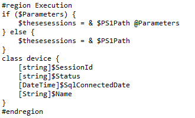
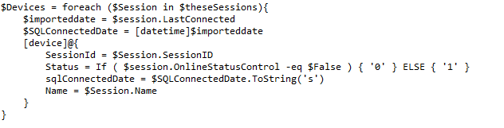
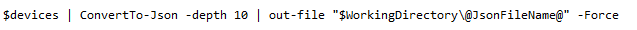

## Summary

Occasionally, a returned SQL insert string may exceed the 65,500 character limit. The intention of this script is to take in a collection of data (from a JSON file stored in the working directory), determine the most efficient number of rows to select for the insert statement, populate that result, execute the insert statement, and continue this process until all items in the file are inserted into the table.

**File Path**: `C:/ProgramData/_Automation/script/Get-PowerPlan/Manage-OverFlowedVariable.ps1`  
**File Hash (SHA256)**: `79B76E6780B61ED657C7FC07C5C0D9A0662165066D5BAD95D9D672513BADD674`  
**File Hash (MD5)**: `12B41CDBC04010E638D3FFB8A4BDB1D6`  

## Sample Run

This is a function script and should not be run manually.

## Variables

| Name                     | Set Location     | Description                                                                                                                                               |
|--------------------------|------------------|-----------------------------------------------------------------------------------------------------------------------------------------------------------|
| `@JsonFileName@`        | Calling Script    | This is the name of the JSON file that will temporarily hold any returned data on the local computer.                                                  |
| `@SQLStartStatement@`    | Calling Script    | The SQL Insert Statement from "Insert Into" to "Values". Formatted as: "Insert Into @TableName@ (ControllerId, SiteName, SiteDesc, name, passphrase, Enabled, isguest, security, WPAMode) VALUES " |
| `@SQLTailString@`       | Calling Script    | The SQL Insert Statement from "On Duplicate" to the end of the string. Formatted as: " ON DUPLICATE KEY UPDATE Online = VALUES(Online), LastConnectedDate = VALUES(LastConnectedDate)" |
| `@DataPointNames@`      | Calling Script    | A comma-separated list of the individual saved object names. GUID, Model, Manufacturer, State                                                              |
| `@LimitedOverFlowResults@` | Script           | The results of the PowerShell script that formats the SQL statement to its most optimized for space limits.                                            |
| `@TotalRowsToWrite@`    | Script           | This variable is created when splitting `@LimitedOverFlowResults@` and holds the number of data points in the JSON file.                               |
| `@TotalRowsToLimit@`    | Script           | This variable is created when splitting `@LimitedOverFlowResults@` and holds the number of data points Automate can handle before exceeding the variable space limit of Automate. |
| `@SQLInsert@`           | Script           | This variable is created when splitting `@LimitedOverFlowResults@` and holds the limited SQL insert statement to be executed.                           |

## Process

1. In any script where you expect that a variable overflow is likely:
   1. Add a variable named `JsonFileName`, and set it to the name of the temporary JSON file you wish to create.
      
   2. Add a variable named `SQLStartStatement`, and set it to the SQL Insert Statement from "Insert Into" to "Values".
      
      Note the space between "Values" and the trailing quotation.
   3. Add a variable named `SQLTailString`, and set it to the SQL Insert Statement from "On Duplicate" to the end of the string.
      
      Note the space between the leading quotation and "ON".
   4. Add a variable named `DataPointNames` and set it to a comma-separated list of the individual saved object names.
      
      You will use these here; notice the similar naming in the class.
      
   5. Modify the PowerShell script and store results in `@psout@`:
      1. Create a class.
         
      2. Populate your class with items.
         
      3. Export your data to JSON.
         
   6. Call the Parse - OverflowedVariable script after the PowerShell run.
      

## PowerShell Procedure

1. Gather all data from the JSON file you designated.
2. Take in all necessary variables from Automate:
   - `DataPointNames`
   - `SQLTailString`
   - `SQLStartStatement`
3. For every data point in the JSON file:
   - Get every DataPoint Name and populate `\"'$($DataPoint.($DataPointName))'\"}) -join ','`, count each DataPoint's character count, and return the average DataPoint count.
4. Calculate the available space:
   - `= 60000 - (The length of the SQLStartStatement plus the length of the SQLTailString)`
5. Calculate the total DataPoints that can be listed before running out of characters:
   - The available space divided by the average characters, rounded down.
6. Re-gather the data from the JSON file, but this time select the first total DataPoints that can be written from step 5.
7. Populate the SQL Statement.
8. Overwrite the JSON file with the original data, only this time skip the total DataPoints that can be written from step 5.
9. Populate an object containing the following data:
   - `TotalRowsToWrite`
   - `TotalRowsToLimit`
   - `SQLInsert`
10. Return that object.

