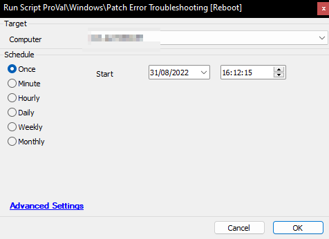

## Summary

This script helps to reset all the windows update components. It performs actions like:
- Stopping the windows update, bits, cryptsvc, and appidsvc services.
- Removes `%ALLUSERSPROFILE%/Application Data/Microsoft/Network/Downloader/qmgr*.dat`
- Removes `C:/Users/All Users/Microsoft/Network/Downloader/qmgr*.dat`
- Renames the softwaredistribution file to softwaredistribution.bak
- Renames the catroot2 file to catroot2.bak
- Resets all windows update dlls
- Performs a Winsock reset
- Starts services windows update, bits, cryptsvc, and appidsvc.

Reboot the computer.

**Time Saved by Automation:** 20 Minutes

## Sample Run

**Target:** Windows Device  
**Note:** This script will forcefully reboot to the target device. It may not be ideal to run this script during business hours.

## Process

1. Create a .BAT file in the `C:/temp/` folder and the script will execute the .BAT file.
   1. The .BAT file will stop and then start several services and delete or rename some files (View all actions below)
      1. Stop services: windows update, bits, cryptsvc, and appidsvc
      2. Delete `%ALLUSERSPROFILE%/Application Data/Microsoft/Network/Downloader/qmgr*.dat`
      3. Delete `C:/Users/All Users/Microsoft/Network/Downloader/qmgr*.dat`
      4. Rename the softwaredistribution file to softwaredistribution.bak
      5. Rename the catroot2 file to catroot2.bak
      6. Reset all windows update dll
      7. Winsock reset
      8. Start services windows update, bits, cryptsvc, and appidsvc.

## Output

**Script logs**

