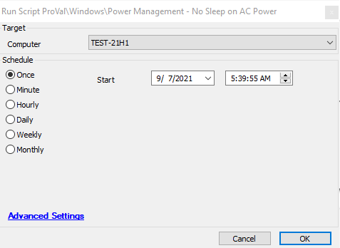

## Summary

Sets the computer to not sleep when plugged in.

Time Saved by Automation: 5 Minutes

## Sample Run

## Dependencies

[Download NeverSleepAC.exe](https://file.provaltech.com/repo/app/NeverSleepAC.exe)

## Variables

| **Variable Name**    | **Description**                                                                                       |
|-----------------------|-------------------------------------------------------------------------------------------------------|
| ProjectName           | This represents the name of the executable and in this case, it will be NeverSleepAC.               |
| BaseURL               | This represents the base URL and it will be [https://file.provaltech.com/repo](https://file.provaltech.com/repo) in this case. |
| WorkingDirectory       | C:/ProgramData/provaltech/app/@ProjectName@                                                           |
| EXEURL                | @BaseURL@/app/@ProjectName@.exe                                                                      |
| EXEPath               | @WorkingDirectory@/@ProjectName@.exe                                                                  |
| EXETempPath           | @WorkingDirectory@/@ProjectName@-temp.exe                                                             |
| EXELog                | @WorkingDirectory@/@ProjectName@-log.txt                                                              |
| EXEErrorLog           | @WorkingDirectory@/@ProjectName@-errors.txt                                                           |
| LogContent            | @EXELog@                                                                                              |

## Process

This script will download the NeverSleepAC.exe from [NeverSleepAC.exe](https://file.provaltech.com/repo/app/NeverSleepAC.exe). The script is a .NET wrapper that grabs the 3 GUIDs required for powercfg: active scheme, subgroup, and setting. It gets the currently loaded power plan, which means it can adjust user settings from the system account. It adjusts the values for only the AC settings (plugged in) of that current plan:
- Sleep after = Never
- Allow hybrid sleep = Off
- Hibernate after = Never
- Lid Close Action = Nothing (which is only present on mobile HW).

The script will download the EXE file and will execute it.

## Output

- Script log

