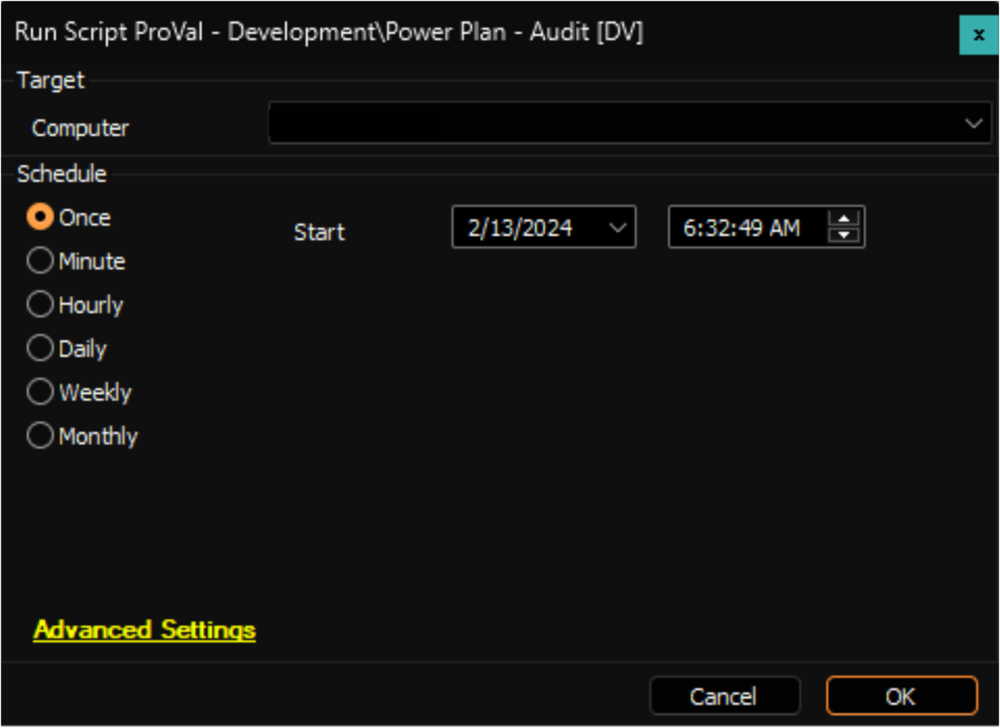

## Summary

This is an Automate implementation of the agnostic script [EPM - Data Collection - Agnostic - Get-PowerPlan](https://proval.itglue.com/DOC-5078775-14439244) to gather data and store it in the [EPM - Data Collection - Custom Table - pvl_powerplan_audit](<../tables/pvl_powerplan_audit.md>) custom table. The data collected is subsequently displayed using the [EPM - Data Collection - Dataview - Power Plan - Audit [Script]](<../dataviews/Power Plan - Audit Script.md>) dataview.

File Path  : C:/ProgramData/_Automation/script/Get-PowerPlan/Get-PowerPlan.ps1  
File Hash (Sha256) : DDE3ACC4A91AB8C7E8971A673AC07B8F4B3B34FA8DAD5849E156C5E6A80DFDF8  
File Hash (MD5)    : AE0FAF82228693C611F4578564FE353C  

File Path : C:/ProgramData/_Automation/script/Get-PowerPlan/Get-PowerPlanAI.ps1  
File Hash (Sha256) : C7CD78CEAC21FF393A913B266CB5C0EC12CEA8E364FA0AD346C287C272463992  
File Hash (MD5)    : 3AFF43D2532BA4AA1D6DB604F613C8EE  

## Sample Run

## Dependencies

- [EPM - Data Collection - Agnostic - Get-PowerPlan](https://proval.itglue.com/DOC-5078775-14439244)  
- [EPM - Data Collection - Internal Monitor - Execute Script - Power Plan - Audit](<../monitors/Execute Script - Power Plan - Audit.md>)  
- [CWM - Automate - Script - OverFlowedVariable - SQL Insert - Execute](<./OverFlowedVariable - SQL Insert - Execute.md>)  

## Variables

| Name               | Description                          |
|--------------------|--------------------------------------|
| TableName          | pvl_powerplan_audit                 |
| ProjectName        | Get-PowerPlan                       |
| WorkingDirectory    | C:/ProgramData/_automation/script/Get-PowerPlan |
| JsonFileName       | Get-PowerPlan.json                  |

## Output

- Script Log
- Custom Table
- Dataview

