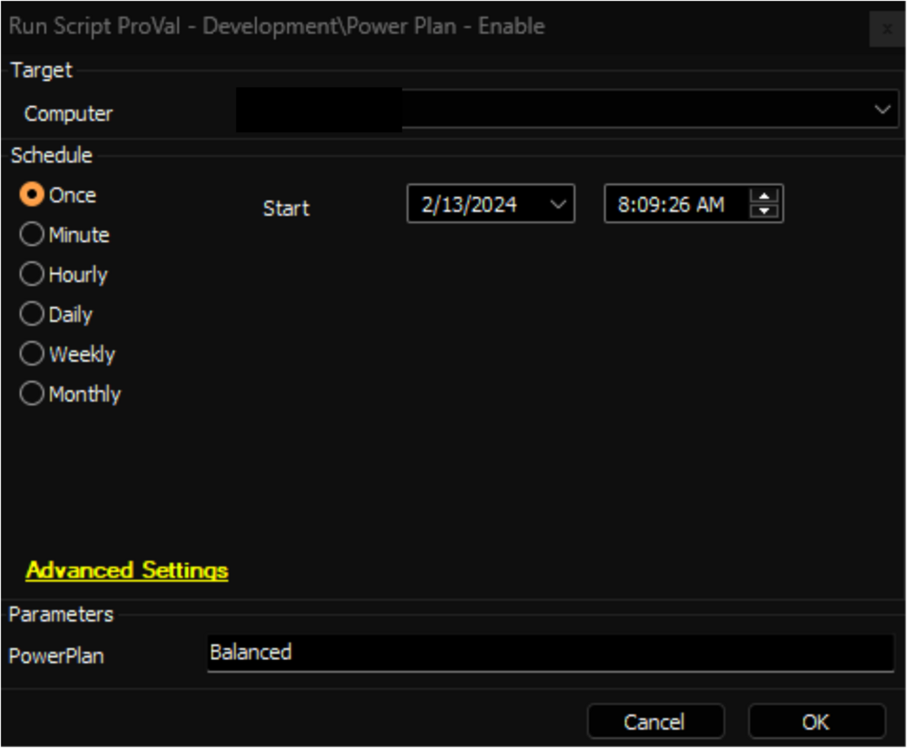

## Summary

This script is an Automate implementation of the agnostic script [EPM - Windows Configuration - Agnostic - Enable-PowerPlan](https://proval.itglue.com/DOC-5078775-14903318). Which can be utilized to mark an existing Power Plan as active.

File Path: `C:/ProgramData/_Automation/script/Enable-PowerPlan/Enable-PowerPlan.ps1`  
File Hash (Sha256): `13F38A3CB96BE9C19B38ED09A1175852B33713DE43368B84867A7999D202F6F3`  
File Hash (MD5): `59BB9E9FB16FD5E53EB657D0F02ED9A8`  

## Sample Run

**Note:**
- Ensure that the name of the `PowerPlan` matches exactly with the `Power Plan` column in the [EPM - Data Collection - Dataview - Power Plan - Audit [Script]](https://proval.itglue.com/DOC-5078775-15053779) dataview.
- After executing the script, changes made at the endpoint can be validated by checking the `Is Active` column for the respective Power Plan in the [EPM - Data Collection - Dataview - Power Plan - Audit [Script]](https://proval.itglue.com/DOC-5078775-15053779) dataview. This column indicates whether the Power Plan has been successfully marked as active/enabled.

## Dependencies

- [EPM - Windows Configuration - Agnostic - Remove-PowerPlan](https://proval.itglue.com/DOC-5078775-14903326)
- [EPM - Data Collection - Script - Power Plan - Audit [DV]](https://proval.itglue.com/DOC-5078775-15053771)
- [EPM - Data Collection - Dataview - Power Plan - Audit [Script]](https://proval.itglue.com/DOC-5078775-15053779)

## Variables

| Name              | Description                                   |
|-------------------|-----------------------------------------------|
| ProjectName       | Enable-PowerPlan                             |
| WorkingDirectory   | C:/ProgramData/_Automation/Script/Enable-PowerPlan |

#### User Parameters

| Name        | Example   | Required | Description                             |
|-------------|-----------|----------|-----------------------------------------|
| PowerPlan   | Balanced  | True     | Name of the Power Plan to enable/activate |

## Output

- Script Log
- Dataview

