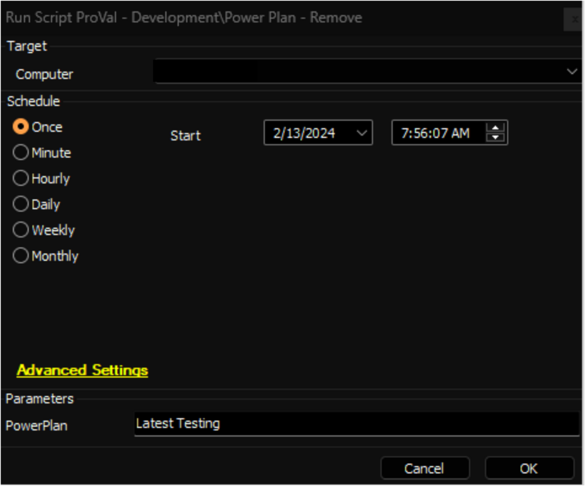

## Summary

This is an Automate implementation of the agnostic script [EPM - Windows Configuration - Agnostic - Remove-PowerPlan](<../../powershell/Remove-PowerPlan.md>).

- **File Path:** C:/ProgramData/_Automation/script/Remove-PowerPlan/Remove-PowerPlan.ps1
- **File Hash (Sha256):** 5CA9E22892E872DE4020E41E6BB4840CD47BBDBBFB4002D6D622E7828D63E64F
- **File Hash (MD5):** D1A1BB2B61D2507BF59E10CB23D140E8

## Sample Run

**Notes:**
- Ensure that the name of the `PowerPlan` matches exactly with the `Power Plan` column in the [EPM - Data Collection - Dataview - Power Plan - Audit [Script]](<../dataviews/Power Plan - Audit Script.md>) dataview.
- The Active Power Plan cannot be removed from the machine directly. To remove the active power plan, you must first set another Power Plan as active on the computer before removing it. This action can be achieved using the [EPM - Windows Configuration - Script - Power Plan - Enable](<./Power Plan - Enable.md>) script.
- The information of the removed power plan will be removed from the [EPM - Data Collection - Dataview - Power Plan - Audit [Script]](<../dataviews/Power Plan - Audit Script.md>) dataview as well.

## Dependencies

- [EPM - Windows Configuration - Agnostic - Remove-PowerPlan](<../../powershell/Remove-PowerPlan.md>)
- [EPM - Data Collection - Script - Power Plan - Audit [DV]](<./Power Plan - Audit DV.md>)
- [EPM - Data Collection - Dataview - Power Plan - Audit [Script]](<../dataviews/Power Plan - Audit Script.md>)

## Variables

| Name              | Description                                         |
|-------------------|-----------------------------------------------------|
| ProjectName       | Remove-PowerPlan                                   |
| WorkingDirectory   | C:/ProgramData/_Automation/Script/Remove-PowerPlan |

#### User Parameters

| Name        | Example          | Required | Description                        |
|-------------|------------------|----------|------------------------------------|
| PowerPlan   | Latest Testing    | True     | Name of the Power Plan to remove   |

## Output

- Script Log
- Dataview

