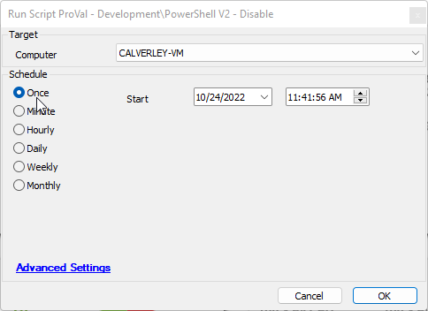

## Summary

This document provides an implementation guide for the Disable-PowershellVersion2 agnostic script.

## Sample Run

## Dependencies

- [EPM - Windows Configuration - Agnostic - Disable-PowershellVersion2](<./EPM - Windows Configuration - Agnostic - Disable-PowershellVersion2.md>)

## Process

Please review the agnostic content document for the complete process.

