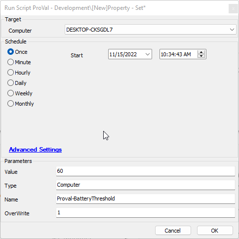
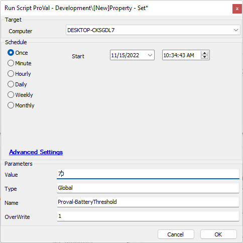

## Summary

This Script is intended to implement a solution to the multiple requests for exclusions in thresholds for targets. If a threshold for an item is set as a global property, there should be a way to trump said policy at the computer level. This script addresses that request and is written in a manner so that it may be implemented in any automate solution.

## Sample Run

  
Above image sets a computer exclusion edf to a new threshold overwriting it if it currently exists.

  
Above image sets a global parameter to a value overwriting it if it exists.

#### User Parameters

| Name      | Example             | Required | Description                                   |
|-----------|---------------------|----------|-----------------------------------------------|
| Value     | Anything            | True     | The value for the desired parameter           |
| Type      | Global or Computer   | True     | The type of parameter to create.              |
| Name      | Anything            | True     | The name of the parameter to create.          |
| Overwrite | 1 or anything       | False    | Toggles overwriting a currently set parameter. |

## Variables

| Name          | Description                                                          |
|---------------|----------------------------------------------------------------------|
| Validate      | Checks for the parameter returns something or -9999 if missing       |
| dataValidate  | Checks for the specific computer parameter data if missing returns -9999 (used if setting computer parameter) |
| GUID          | Creates a guid for use with computer parameter                       |
| EFID          | The id of the Computer parameter.                                    |

## Process

If Global is selected  
- Check for the global parameter  
  - Parameter missing  
    - Create the parameter with the desired value  
  - Parameter exists  
    - Check overwrite if not 1 exit with error if 1 then overwrite current value.  

If Computer is selected  
- Check for the parameter and verify that the specific computer holds data in that parameter, if not returns -9999  
  - If a value is missing for that target  
    - Create the parameter for that target  
  - If a value is present for that target  
    - Check overwrite if not 1 exit with error otherwise overwrite the current target's parameter value.  

