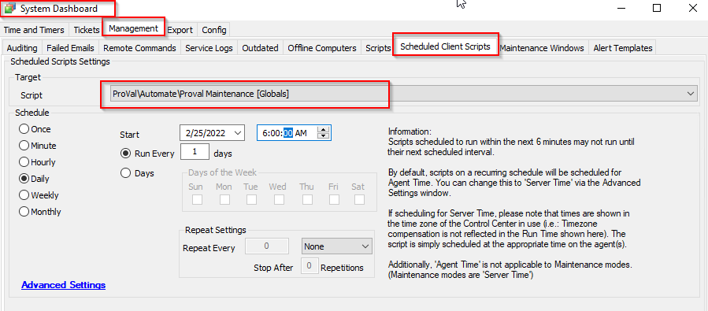

## Summary

This script cleans up old data that Automate wouldn't do so on its own.  

**Time Saved by Automation:** 10 Minutes

## Sample Run

This is a client script and can be scheduled from System > Dashboard > Manage > Scheduled Client Script.

#### Global Parameters

| Name                                   | Example | Required | Description                                                                                     |
|----------------------------------------|---------|----------|-------------------------------------------------------------------------------------------------|
| TicketCleanup_Days                     | 90      | True     | Retention (days) of tickets in the Automate Database                                           |
| MissingDrives_Cleanup                  | 1       | True     | True/False of cleaning up drives no longer detected                                            |
| MissingRoles_Cleanup                   | 1       | True     | True/False of cleaning up roles no longer detected so long as they are not applied roles.     |
| UserCentric_Force_Contacts_Managed     | 0       | True     | True/False of cleaning up old contacts (that aren't AD Sync'd)                                 |
| ScriptHistory_Cleanup                   | 1       | True     | True/False of cleaning up script history based on the global retention setting                 |
| EventLog_Cleanup                       | 1       | True     | True/False of cleaning up event logs based on the global retention setting                     |
| Commands_Cleanup                       | 1       | True     | True/False of cleaning up command history based on the global retention setting                |
| MonitorHistory_Cleanup                 | 1       | True     | True/False of cleaning up Monitor history based on the global retention setting                |
| NetWorkDevice_Cleanup                  | 1       | True     | True/False of purging the network devices older than 60 days based on the global retention setting |
| TicketDataAdditionCleanup_Days         | 30      | True     | Retention (days) of ticket data in the Automate database.                                      |
| InactiveTicketStatus_Cleanup           | 1       | True     | True/False of purging of inactive CW Manage Ticket status(es).                                 |
| PatchManagerHistory_Cleanup            | 1       | True     | True/False of purging of unnecessary historical patch manager data.                             |

## Process

This script cleans up lots of tables in the database, in order of operation:

1. Ticket clean up
2. TicketData Clean up
3. Missing Drives
4. Missing Roles
5. User Centric Contacts
6. Script History
7. Event Logs
8. Commands History
9. Monitor History
10. Network Device Cleanup
11. Inactive Ticket Status Cleanup
12. Patch Manager History Cleanup

