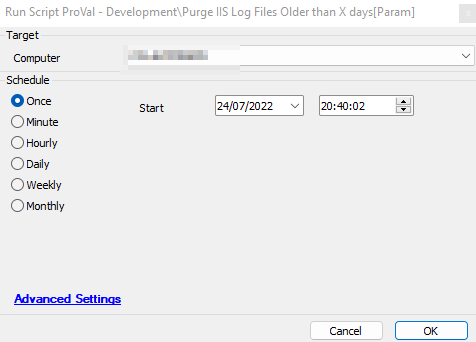
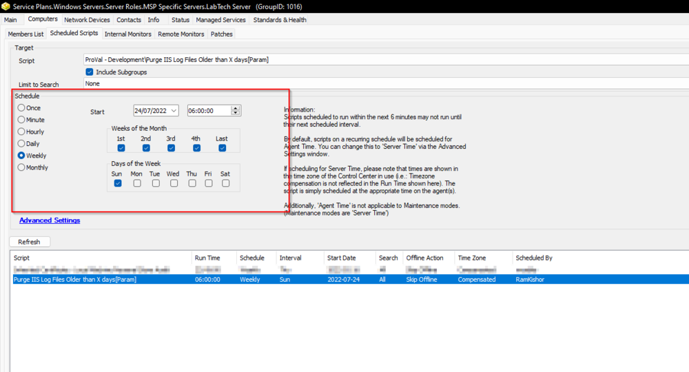

## Summary

This script will remove IIS log files older than (Global Variable, *Days*) days only if the size of the `c:/inetpub/logs/logfiles/w3svc` folder is greater than (Global Variable *Size*) MB.  
The recommended schedule for this script is:  
**Target:** "Labtech Server" Group  
**Occurrence:** Run once per week  

**By default, it will remove the logs older than 30 days if the size of the directory is greater than 1024 MB.**  

Also, the script can be used for on-prem partners only.

## Sample Run

  

Preferred is to schedule the script against the "Labtech Server" to run once per week:  
  

## Variables

| Name  | Description                                          |
|-------|------------------------------------------------------|
| psout | Outcome of the PowerShell running to purge the IIS logs |

#### Global Parameters

| Name  | Example                       | Required | Description                                                                                     |
|-------|-------------------------------|----------|-------------------------------------------------------------------------------------------------|
| days  | 30                            | True     | Days to keep the logs. Default is 30                                                           |
| Size  | 1024                          | True     | Threshold in MB to initiate the purging. The script will only remove the IIS logs older if the size of the logs directory goes above this size. Default is 1024 |
| path  | c:/inetpub/logs/logfiles/w3svc*/*.log | True     | Path to the IIS logs                                                                             |

## Process

Step 1: Executes a PowerShell script to verify the size of the logs directory and to clear the logs older than `@days@` days, if it finds the size above `@size@` MB.  
Step 2: Generates the logs as per the PowerShell script's outcome and exits.  

## Output

- Script Log
