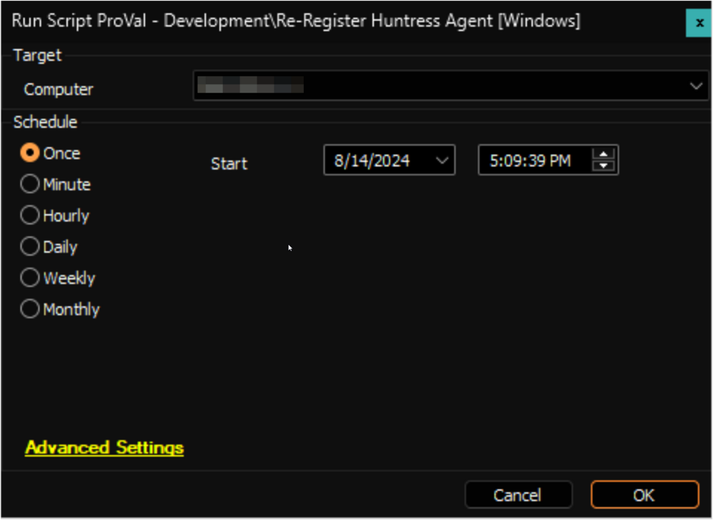

## Summary

This script can be used to re-register Huntress Agent for the Windows machines.

**File Hash:**
- **MD5:** `8F19848478D623C13615D166134FE8C1`
- **SHA256:** `DFC9C59A249E2C5EA0E3AD26CD9639F7F6953FF9781A17823BF84A6009627076`

## Sample Run

## Dependencies

- [InstallHuntress.powershellv2.ps1](https://raw.githubusercontent.com/huntresslabs/deployment-scripts/main/Powershell/InstallHuntress.powershellv2.ps1)
- [SEC - Windows Protection - Script - Deploy Huntress Agent [Windows, Mac]](https://proval.itglue.com/DOC-5078775-16803042)

## Variables

| Name               | Description                                                  |
|--------------------|--------------------------------------------------------------|
| projectName        | Invoke-HuntressAgentCommand                                  |
| workingDirectory    | C:/ProgramData/_Automation/Script/Invoke-HuntressAgentCommand |
| scriptPath         | C:/ProgramData/_Automation/Script/Invoke-HuntressAgentCommand/Invoke-HuntressAgentCommand.ps1 |

## Client-Level EDF

| Name                          | Type   | Example              | Section        | Required | Description                                                                                              |
|-------------------------------|--------|----------------------|----------------|----------|----------------------------------------------------------------------------------------------------------|
| Huntress Agent - Account Key   | Text   | 1SA2345AASSSS234     | Security Tools | True     | This is the Account Key that determines which Huntress Account an Agent should be associated with.      |
| Huntress Agent - Org Key       | Text   | Development          | Security Tools | False    | By default, Huntress Organization key is the name of the client. Set this EDF if it's different for the client. |

**These EDFs can be created by running the [Deploy Huntress Agent [Windows, Mac]](https://proval.itglue.com/DOC-5078775-16803042) script with the `Set_Environment` parameter set to `1`.**

## Location-Level EDF

| Name                             | Type       | Example | Section        | Required | Description                                                                                              |
|----------------------------------|------------|---------|----------------|----------|----------------------------------------------------------------------------------------------------------|
| Huntress Agent Install - Exclude | Check-Box  | 0/1     | Security Tools | False    | Mark this EDF to exclude the location from the Auto deployment of the Huntress Agent from the [Deploy Huntress Agent](https://proval.itglue.com/DOC-5078775-16803099) monitor set. |

**This EDF can be created by running the [Deploy Huntress Agent [Windows, Mac]](https://proval.itglue.com/DOC-5078775-16803042) script with the `Set_Environment` parameter set to `1`.**

## Output

- Script log

