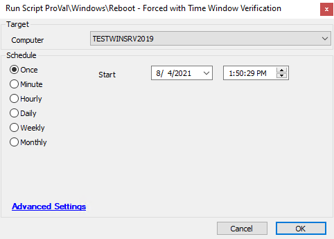

## Summary

This script will reboot a machine, but only if it is within a preconfigured time window. The window is **not** configured by default.

**Time Saved by Automation:** 5 Minutes

## Sample Run

## Dependencies

- Global variables must be set up correctly.

## Variables

- `@PSResult@` -> Output from the PowerShell time window check
- `@MachineTime@` -> Grabs the local time of the machine
- `@newuptime@` -> Gets the latest uptime from the Automate Database

#### Global Parameters

| Name        | Example                                                                 | Required | Description                          |
|-------------|-------------------------------------------------------------------------|----------|--------------------------------------|
| WindowStart | 0 = Midnight, 1 = 1:00 AM, 5 = 5:00 AM, 11 = 11:00 AM, 23 = 11:00 PM  | True     | When the window is open to reboot    |
| WindowEnd   | 0 = Midnight, 1 = 1:00 AM, 5 = 5:00 AM, 11 = 11:00 AM, 23 = 11:00 PM  | True     | When the window is closed to reboot   |

## Output

- Script log

