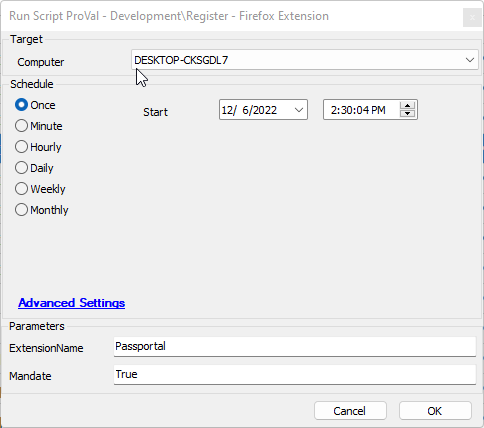

## Summary

Will Register a given extension for the Firefox browser.

## Sample Run

  
This will install the N-Able Passportal extension and make that extension protected from deletion.  
Leaving Mandate Blank will not protect the extension from deletion.  
Obtain your extension name from the Firefox extension store.

## Dependencies

This should be a list of ITGlue documents listed in the Related Items sidebar on which this script depends.

- [SWM - Software Configuration - Register-FirefoxExtension](https://proval.itglue.com/DOC-5078775-10372105)

#### User Parameters

| Name          | Example     | Required | Description                                      |
|---------------|-------------|----------|--------------------------------------------------|
| ExtensionName | Passportal  | True     | The name of the Extension you wish to install    |
| Mandate       | True        | False    | Set to True to protect the extension from removal.|

## Process

Please Review the agnostic content for specifics on the process.

## Output

- Script log

