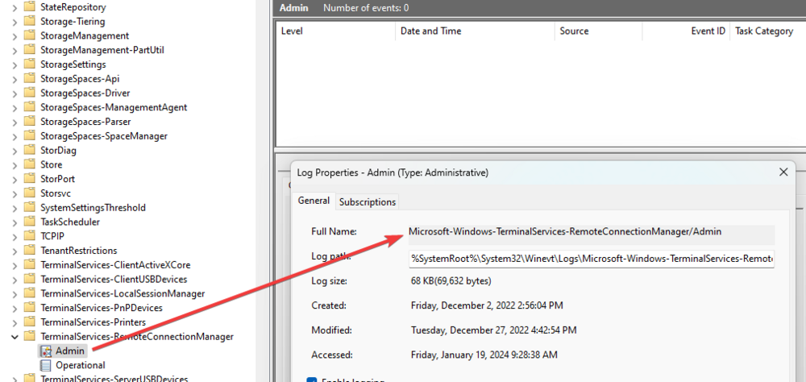
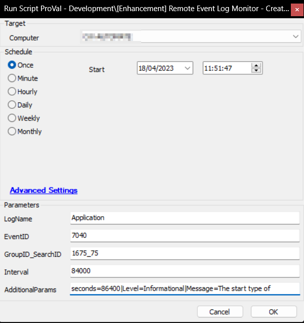
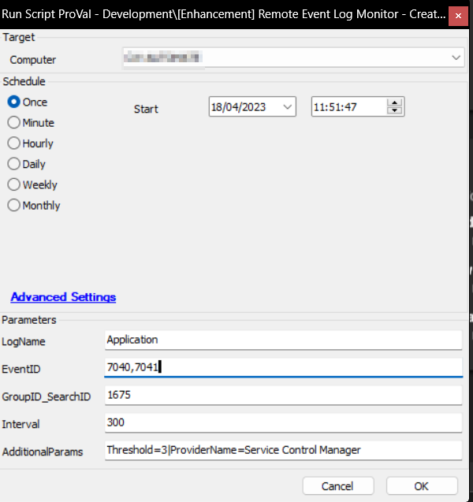
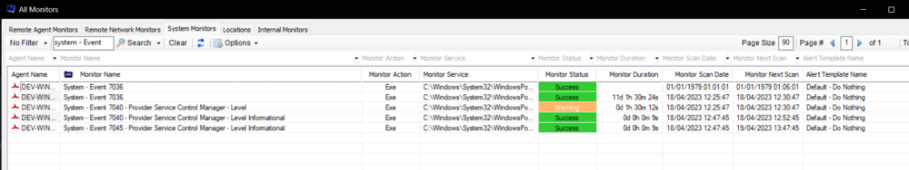
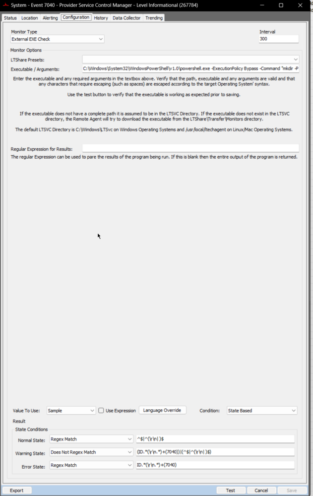
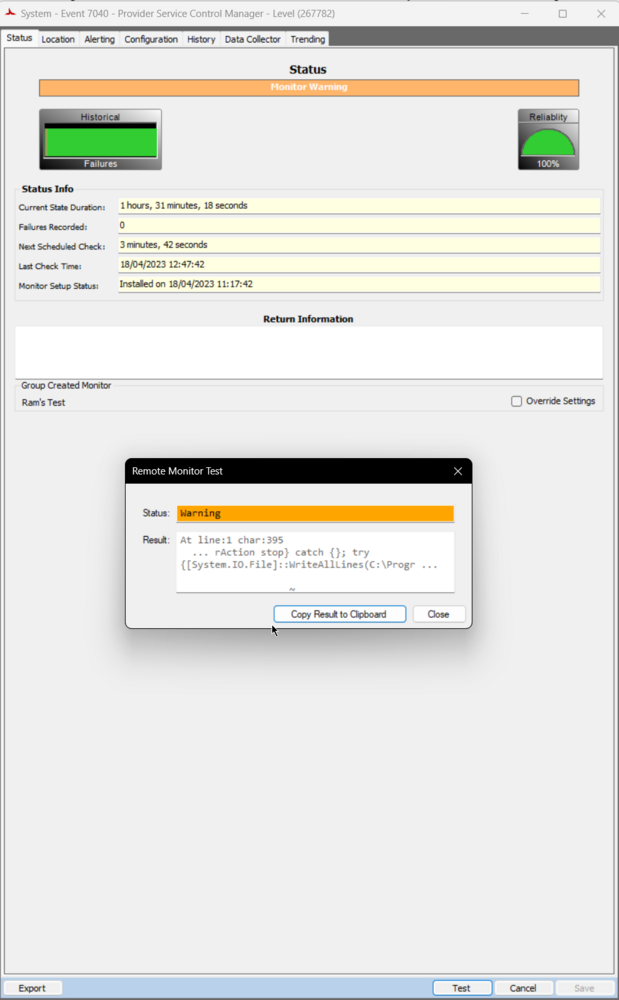
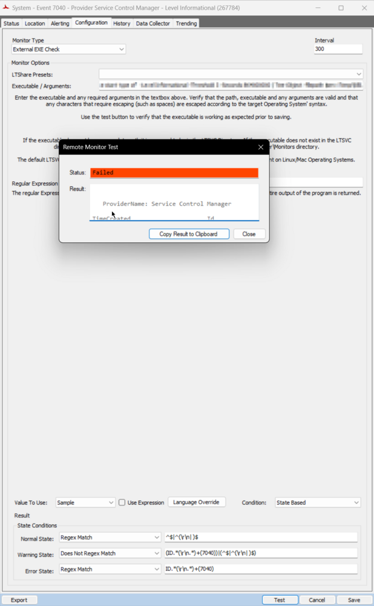
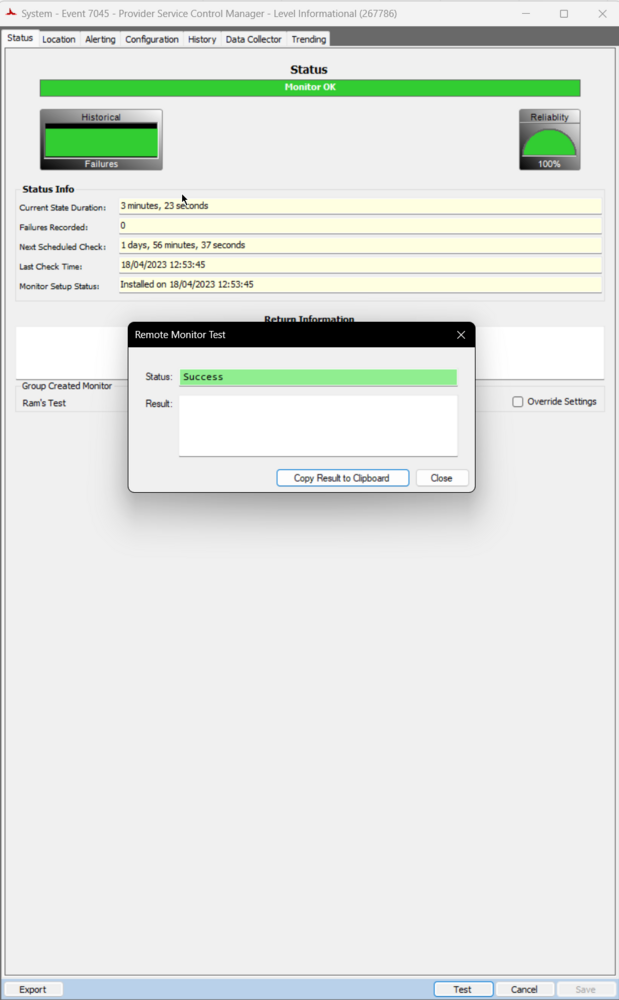
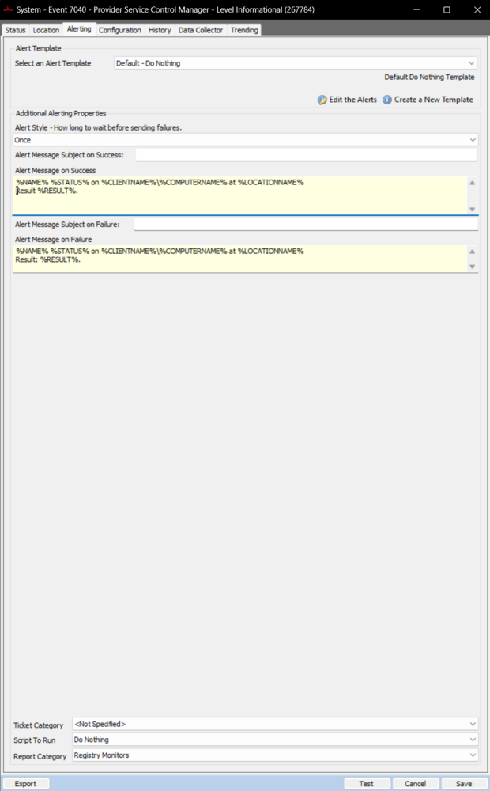

## Summary

This Automate Script will create a state-based event log monitor on the specifically requested group. It will by default set these monitors to the "Default - Do Nothing" alert template and needs to be modified to fit your desired result after creation.

PowerShell-related issues are addressed in the WARNING state. It is suggested to use [CWM - Automate - Script - Ticket Creation - Computer](https://proval.itglue.com/DOC-5078775-9098338) script for ERROR state alerting, as the remote monitor truncates the message while creating a default ticket using the alert template.

Note: You have to review the properties of the event log to monitor to determine the name.



## Requirements

This script will simply create the remote monitor on a group with the default settings being:
1. Do nothing
2. No error actions
3. No alert actions

If you desire a different end result, the monitor will need to be modified manually.

## Sample Run

Intended Target: Any Computer (offline Computer Script)

The following parameters will configure a remote monitor on groupid 1675, restricted to searchid 75:
- Monitor Name: Application - Event 7040 - Level Informational
- Monitor Schedule: Every 84000 seconds

The aforementioned monitor will be designed to scan for Informational events from the Application log, which contain an event ID of 7040, the message within the event log containing the phrase "The Start Type of", and generated over the last 86400 seconds.



The following parameters will be utilized to configure a remote monitor on groupid 1675, restricted to searchid 75:
- Monitor Name: Application - Event 7040,7041 - Provider Service Control Manager
- Monitor Schedule: Every 300 seconds

The aforementioned monitor will be designed to scan for all events from the Application log, which contain an event ID of 7040 or 7041, with the provider name of 'Service Control Manager', and have generated at least thrice over the last 300 seconds (Monitor's interval).



## Dependencies

- [EPM - Data Collection - Agnostic - Script - Get-RecentEventLog](https://proval.itglue.com/DOC-5078775-9751473)  
  [Documentation Link](https://app.myglue.com/help_center/documents/9751473)

## Variables

| Name                   | Description                                                                                      |
|------------------------|--------------------------------------------------------------------------------------------------|
| GroupID_SearchID       | Holds parsed GroupID and SearchID from the user parameters                                      |
| GroupID                | Holds the Groupid you specified                                                                  |
| SearchID               | Holds the SearchID you specified                                                                 |
| CheckAction            | Holds the check action to be taken on the remote monitor (File)                                 |
| AlertAction            | Holds the alert action to be taken on the remote monitor (Default is Default Do Nothing)        |
| ProjectName            | Get-RecentEventLog                                                                               |
| WorkingDirectory        | C://ProgramData//_automation//script//Get-RecentEventlog                                       |
| PS1Path                | C://ProgramData//_automation//script//Get-RecentEventLog//Get-RecentEventLog.ps1               |
| AdditionalParams       | Additional Parameters provided from the user parameters                                          |
| Interval               | Run time interval of the monitor set in seconds                                                 |
| LogNameSwitch          | Converts the desired LogName to a formatted LogName switch for the agnostic script              |
| EventIDSwitch          | Converts the desired event id to a formatted event id switch for the agnostic script            |
| ProviderSwitch         | Converts the desired ProviderName to a formatted provider name switch for the agnostic script    |
| Message                | Message passed in the additionalparams user parameter with SQL compatible modifications          |
| MessageSwitch          | Converts the desired message to a formatted Message switch for the agnostic script               |
| LevelSwitch            | Converts the desired Level to a formatted Level switch for the agnostic script                  |
| SecondsSwitch          | Converts the desired Seconds to a formatted Seconds switch for the agnostic script               |
| AdditionalParameters    | Formatted Additional Parameters provided from the user parameters                                |
| GUID                   | GUID for the remote monitor                                                                       |
| ComparisionString      | Formatted conditions to be used within the remote monitor for NORMAL, WARNING, and FAILED states |
| ExecuteString          | Command to be used within the remote monitor                                                     |

### User Parameters

| Name                   | Example                         | Required | Description                                                                                |
|------------------------|---------------------------------|----------|--------------------------------------------------------------------------------------------|
| LogName                | Application                     | True     | The event log sub container you wish to query.                                           |
| EventID                | 7040                            | True     | The event Id you wish to query for in the log selected.                                  |
| GroupID_SearchID       | 1675_75                         | True     | The id of the group you wish to create the monitor upon, and the searchid to limit it.  |
| Interval               | 3600                            | False    | Interval to run the monitor set. Leaving it blank or setting it lower than 60 will default it to 60. |
| AdditionalParams       | seconds=86400|Level=Informational|Message=The start type of|Threshold=3|ProviderName=Service Control Manager | False | Holds additional optional parameters. Optional parameters are: ProviderName, Message, Level, Seconds. |

**Note:** Do Not enclose the parameters under quotations.

## Output

- Script log
- Remote Monitor

## Sample Remote Monitors

# Multiple Monitors:


# Configuration Tab:


# Example Warning:


# Example Failed:


# Example Success:


# Alerting Tab:


# Example %RESULT%
```
ProviderName: Service Control Manager
TimeCreated                            Id LevelDisplayName Message
-----------                            -- ---------------- ------- 
4/18/2023 9:53:50 AM               7040 Information      The start type of the Background Intelligent Transfer Service s...
4/18/2023 9:44:28 AM               7040 Information      The start type of the Background Intelligent Transfer Service s...
4/18/2023 9:40:19 AM               7040 Information      The start type of the Background Intelligent Transfer Service s...
4/18/2023 9:37:56 AM               7040 Information      The start type of the Background Intelligent Transfer Service s...
4/18/2023 9:35:50 AM               7040 Information      The start type of the Background Intelligent Transfer Service s...
4/18/2023 9:23:01 AM               7040 Information      The start type of the Background Intelligent Transfer Service s...
4/18/2023 9:18:12 AM               7040 Information      The start type of the Background Intelligent Transfer Service s...
4/18/2023 9:06:48 AM               7040 Information      The start type of the Background Intelligent Transfer Service s...
4/18/2023 9:01:58 AM               7040 Information      The start type of the Background Intelligent Transfer Service s...
```


