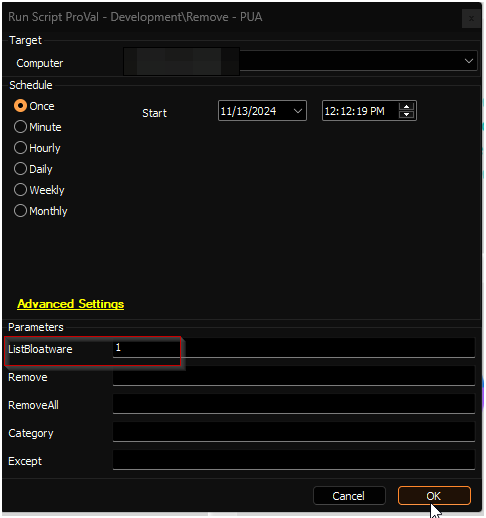
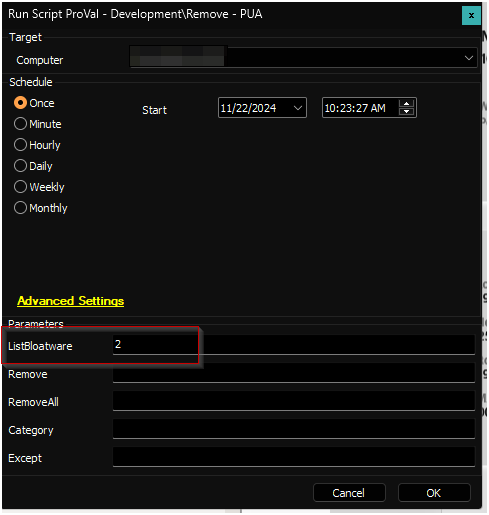
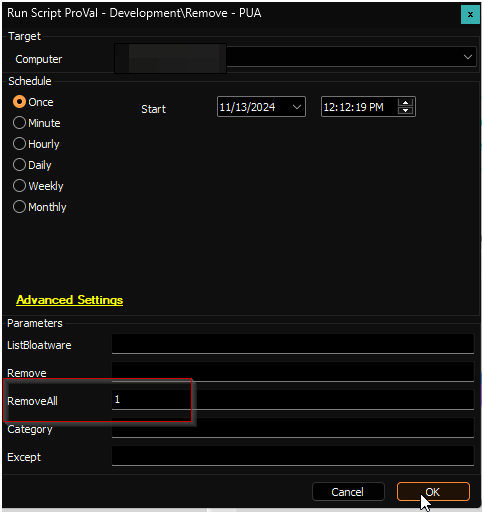
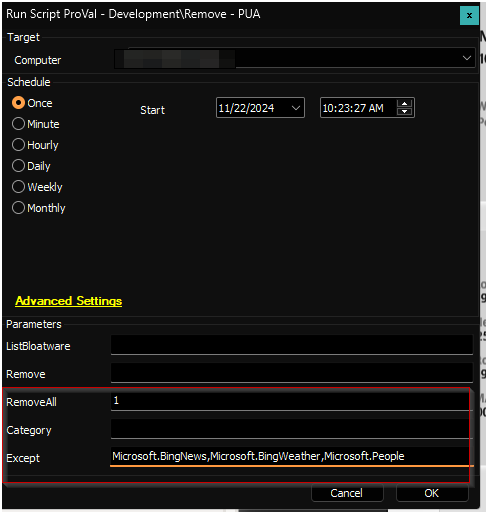
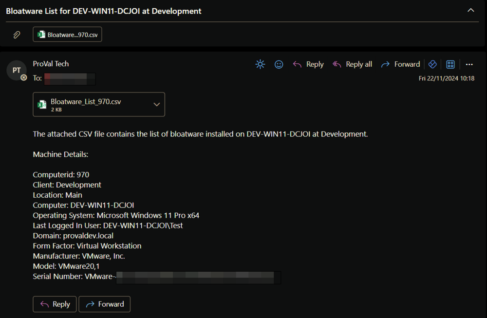
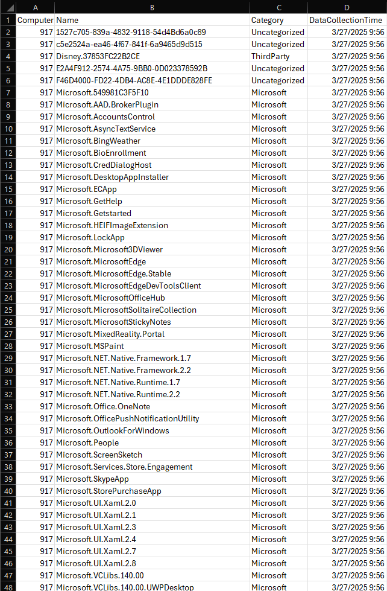

## Summary

A CWA implementation of the agnostic script [Remove-PUA](<../../powershell/Remove-PUA.md>). Data fetched by the script using the `ListBloatware` parameter can be viewed in the [Bloatware Audit](<../dataviews/Bloatware Audit.md>) dataview.

The `Remove` parameter can be used to bypass the category filter and remove any installed AppxPackage by its ID, including packages not present in the [PUA List](https://content.provaltech.com/attachments/potentially-unwanted-applications.json).

**EXERCISE EXTREME CAUTION - Removing system components may cause system instability.**

## File Hash

**File Path:** `C:\ProgramData\_automation\Script\Remove-PUA\Manage-OverFlowedVariable.ps1`  
**File Hash (Sha256):** `79B76E6780B61ED657C7FC07C5C0D9A0662165066D5BAD95D9D672513BADD674`  
**File Hash (MD5):** `12B41CDBC04010E638D3FFB8A4BDB1D6`  

**File Path:** `C:\ProgramData\_automation\Script\Remove-PUA\Remove-PUA-AI.ps1`  
**File Hash (Sha256):** `193A1F83B0DE6B329C536DF02B3744C368E9247394C237103BC24DEF7267864E`  
**File Hash (MD5):** `01957AAF757A1B88704D4A3BB6DAAF29`  

**File Path:** `C:\ProgramData\_automation\Script\Remove-PUA\Remove-PUA.ps1`  
**File Hash (Sha256):** `84D43EDF2E800A1056ECE01B13C199F4F4900F58D2B0C5070A023936B098C84B`  
**File Hash (MD5):** `B20CBE9B008988A5991DE61DB1042BF3`  

## Sample Run

To fetch the list of installed bloatware into the [Bloatware Audit](<../dataviews/Bloatware Audit.md>) dataview:  

To fetch the list of installed bloatware and email it to the user running the script:  

To remove specific bloatware `Microsoft.BingNews`, `Microsoft.BingWeather`, and `Microsoft.People`:  

To remove all installed bloatware supported by the script:  

To remove all installed bloatware supported by the script except `Microsoft.BingNews`, `Microsoft.BingWeather`, and `Microsoft.People`:  
 

## Dependencies

[SWM - Software Uninstall - Agnostic - Remove-PUA](<../../powershell/Remove-PUA.md>)  
[CWM - Automate - Script - OverFlowedVariable - SQL Insert - Execute](<./OverFlowedVariable - SQL Insert - Execute.md>)

## User Parameters

| Name          | Example                                          | Accepted Values                                                                                     | Required   | Description                                                                                                                                                                            |
|---------------|--------------------------------------------------|-----------------------------------------------------------------------------------------------------|------------|----------------------------------------------------------------------------------------------------------------------------------------------------------------------------------------|
| ListBloatware | 1                                                | <ul><li>1</li><li>2</li></ul>                                                                                          | Partially  | `1`: Fetch installed bloatware into the [Bloatware Audit](<../dataviews/Bloatware Audit.md>) dataview. `2`: Fetch installed bloatware into the [Bloatware Audit](<../dataviews/Bloatware Audit.md>) dataview and send the list to the user running the script.  |
| Remove        | Microsoft.BingNews, Microsoft.BingWeather, Microsoft.People |                                                                                                     | Partially  | The name(s) of the application or applications you wish to uninstall. It can be used to remove any installed AppxPackage on the computer.                                                                                                          |
| Remove All    | 1                                                |                                                                                                     | Partially  | Set it to 1 to remove all bloatware by category or all found bloatware with or without exceptions.                                                                                   |
| Category      | MsftBloatApps                                | <li>MsftBloatApps</li><li>ThirdPartyBloatApps</li> | False      | Used with RemoveAll to filter bloatware to a certain category, allowing you to select just a specific category of bloatware.                                                        |
| Except        | Microsoft.Copilot, Microsoft.BingWeather                                |                                                                                                     | False      | Used with RemoveAll or Category to remove all except some item(s) from a category.                                                                                 |

**Note:** `RemoveAll`, `Category`, and `Except` parameters are limited to the [PUA List](https://content.provaltech.com/attachments/potentially-unwanted-applications.json).

## Emailing

The script is designed to send the list of installed bloatware to the user running the script if the `ListBloatware` parameter is set to `2`.

**Sample Email:**  

**Sample CSV File:**  

## Output

- Script log
- Dataview (if the `ListBloatware` parameter is used)
- Email (if the `ListBloatware` parameter is set to `2`)