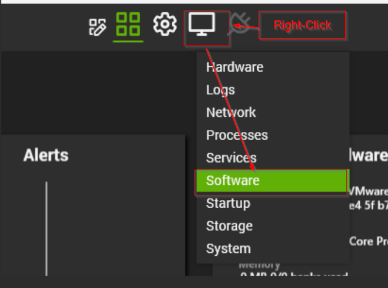
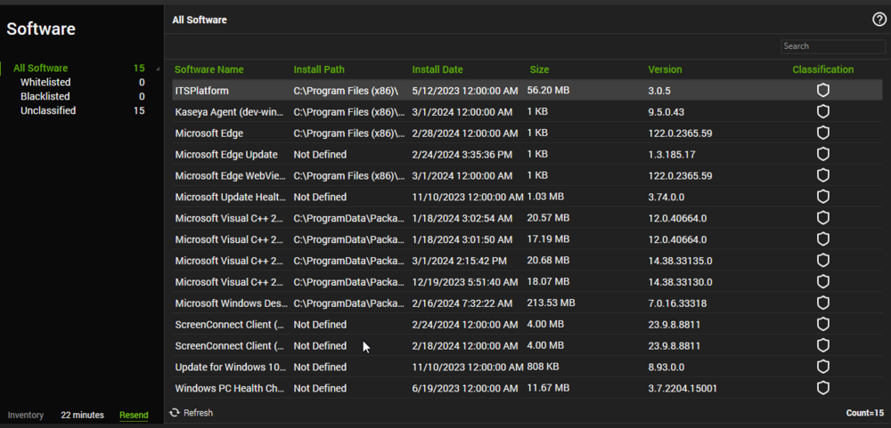
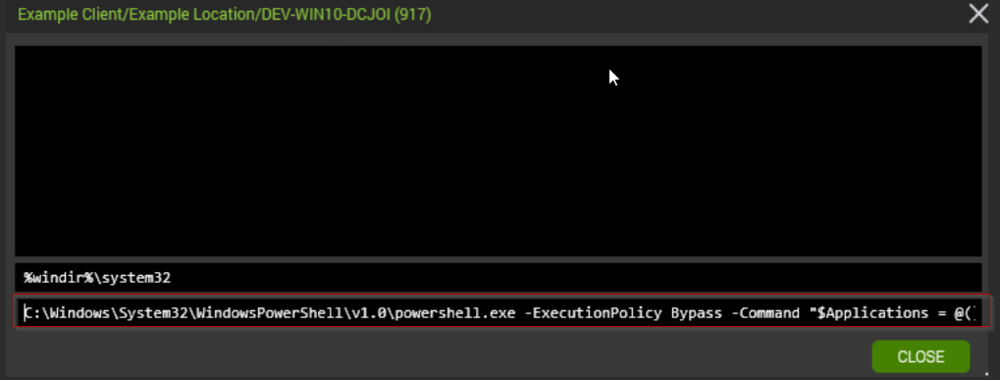
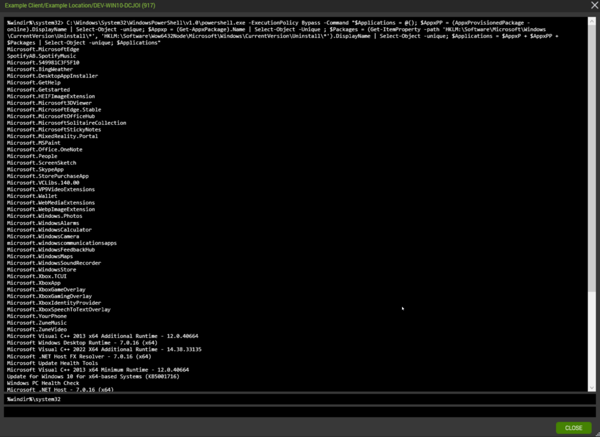
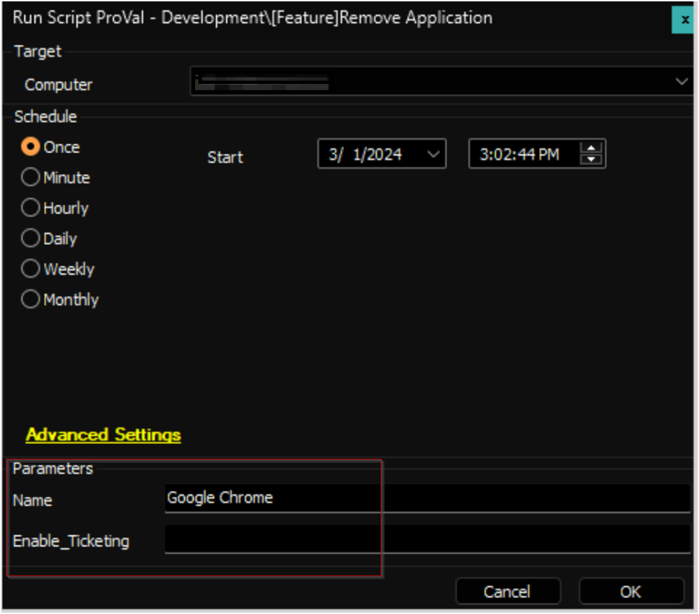
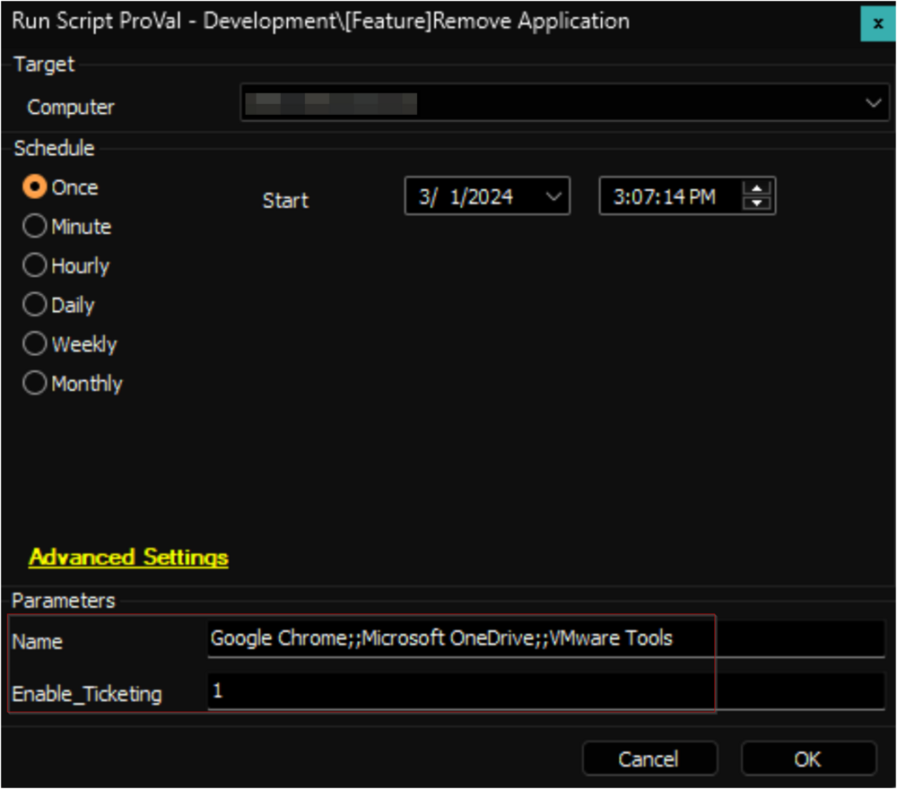
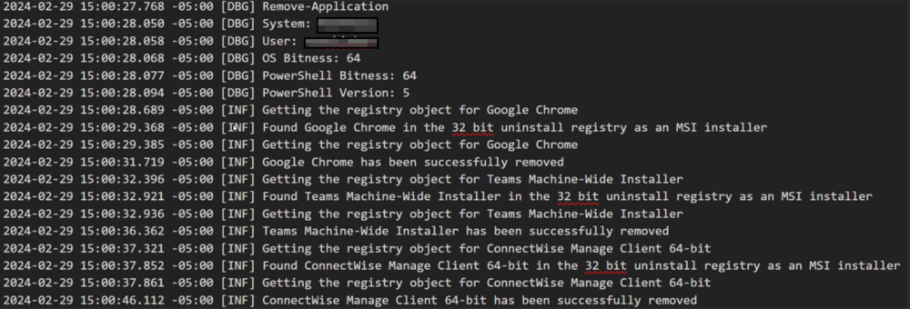

## Summary

This script is designed to facilitate the removal of specified software packages from a computer system. It supports both single and multiple application names for removal and includes functionality to uninstall bloatware that might not be listed in the Programs and Features.

However, it's crucial to exercise caution while using this script, as it will attempt to remove any software specified without discrimination and in a silent manner.

Additionally, if the removal process encounters any errors, it will generate a generic error log and will create a ticket if the `Enable_Ticketing` parameter is set to `1`.

Before utilizing this script, it's strongly recommended to have a developer verify its suitability for removing the targeted package(s).

The script requires the application name(s) to precisely match those listed under the `Software` tile in the machine's Computer Management screen (CMS).





If an application's name isn't found in the Software tile, you can utilize the following command to compile a list of installed applications and bloatware programs on the computer.

```
C:/Windows/System32/WindowsPowerShell/v1.0/powershell.exe -ExecutionPolicy Bypass -Command "$Applications = @(); $AppxPP = (AppxProvisionedPackage -online).DisplayName | Select-Object -unique; $Appxp = (Get-AppxPackage).Name | Select-Object -Unique; $Packages = (Get-ItemProperty -path 'HKLM:/Software/Microsoft/Windows/CurrentVersion/Uninstall/*', 'HKLM:/Software/Wow6432Node/Microsoft/Windows/CurrentVersion/Uninstall/*').DisplayName | Select-Object -unique; $Applications = $AppxP + $AppxPP + $Packages | Select-Object -unique; $Applications"
```

Ensure that the application name(s) specified as user parameters exactly match those listed in the output of the above command.

### Executing Command from CMS

- Open the CMS for the concerned machine.
- Click the `ToolBox` icon.
- Click the `Command Prompt` option.


Type or paste the command in the command prompt and press the `Enter` button on your keyboard to execute the command.




## Sample Runs

- Uninstall Google Chrome and do not create a ticket on failure.  
  **Name:** Google Chrome  
  

- Uninstall Google Chrome, Microsoft OneDrive, VMWare Tools, and create a ticket on failure.  
  **Name:** `Google Chrome;;Microsoft OneDrive;;VMware Tools`  
  **Enable_Ticketing:** `1`  
  

## Dependencies

[SWM - Software Uninstall - Agnostic - Remove-Application](<../../powershell/Remove-Application.md>)

## Variables

| Name               | Description                                                   |
|--------------------|---------------------------------------------------------------|
| ProjectName        | Remove-Application                                           |
| WorkingDirectory    | C:/ProgramData/_automation/script/Remove-Application        |
| PS1Log             | C:/ProgramData/_automation/script/Remove-Application/Remove-Application-log.txt |

## User Parameters

| Name               | Example                                                         | Mandatory | Description                                                                                                                                                                                                                   |
|--------------------|-----------------------------------------------------------------|-----------|-------------------------------------------------------------------------------------------------------------------------------------------------------------------------------------------------------------------------------|
| Name               | Google Chrome;;Microsoft OneDrive;;VMware Tools                | True      | The name of the application(s) to remove. When specifying multiple application names, ensure they are separated by double semi-colons (;;), without any spaces, as depicted in the example.                                   |
| Enable_Ticketing   | 1                                                               | False     | Setting this parameter to `1` will enable the ticket creation feature of the script, and the script will create a ticket if it fails to uninstall all application(s) from the provided list.                                 |

## Output

- Script Logs
- Log file on the end machine
- Ticket (if enabled)

## Ticketing

**Subject:** `Application Removal - Failed - %COMPUTERNAME%`

**Summary:**  
`The script attempted to remove the provided list of application(s) from the computer, but it failed. Initially, the following application(s) were identified as installed out of the provided list:`

- `\\<Comma Separated Name(s) of the application(s) from the provided list installed initially on the computer>`

`However, the removal process failed for the following application(s):`

- `\\<Comma Separated list of the application(s) from the provided list that Automate failed to remove from the computer>`

`In addition to the primary removal script (Remove-Application.ps1), alternative uninstallation methods utilizing uninstall strings stored in Automate were also employed. Despite this, the script failed to remove all specified application(s).`

`Please refer to the attached log contents for further investigation. A manual review is required to identify the cause of the failure.`

**Comment:**  
`\\<Contents of the log file generated by the PowerShell Script>`

**Example:**  



