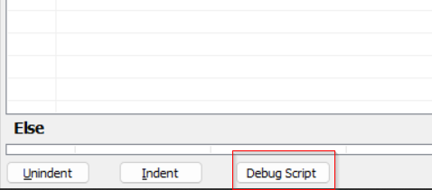
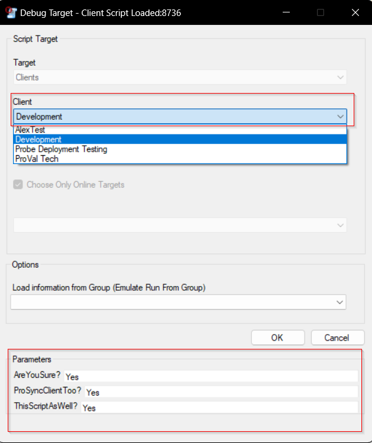

## Summary

The script can be used to remove the content of [Automate Server Monitoring](https://proval.itglue.com/5078775/docs/10390988) from the environment. Only the pieces emailing ProVal will be removed.  
There's an additional parameter that provides you an option to remove ProSyncClient Plugin as well.  

It is developed as a client script, so that no one mistakenly executes the script against any machine. Execute and Edit Permissions are limited to the `Super Admin` only.  

**WARNING: THIS IS A POTENTIALLY DESTRUCTIVE SCRIPT. DO NOT EXECUTE THE SCRIPT UNLESS YOU ARE 100% SURE. DO NOT IMPORT THE SCRIPT TO ANY PARTNER FOR NO REASON. CONSULTANTS' CONSENT IS NECESSARY BEFORE EXECUTING THE SCRIPT. NEVER EXECUTE THE SCRIPT IN OUR (PROVAL'S) INTERNAL ENVIRONMENT.**

## Sample Run

A client script can either be debugged or can be executed against any client. The suggested method is to debug the script.  

  
  

#### User Parameters

| Name                | Example | Required | Description                                                                                                                                                                   |
|---------------------|---------|----------|-------------------------------------------------------------------------------------------------------------------------------------------------------------------------------|
| AreYouSure?         | Yes     | True     | `Yes` to grant your consent to remove the Automate server monitoring; the script will not take any action if this parameter is left blank or provided with some other value. |
| ProSyncClientToo?   | Yes     | False    | `Yes` to grant your consent to remove the `Prosync` client from the environment. `AreYouSure?` parameter must be set to `Yes` to use this parameter.                        |
| ThisScriptAsWell?   | Yes     | False    | `Yes` to remove this script from the environment after getting the work done. `AreYouSure?` and `ProSyncClientToo?` parameters must be set to `Yes` to use this parameter.  |

## Process

- Remove the contents of [Automate Server Monitoring](https://proval.itglue.com/5078775/docs/10390988) from the environment, if `AreYouSure?` parameter is set to 1, otherwise, exit.  
- Remove prosyncclient plugin from the environment, if `ProSyncClientToo?` parameter is set to 1, otherwise, exit.  
- Removes itself from the environment, if `ProSyncClientToo?` parameter is set to 1, otherwise, exit.  

