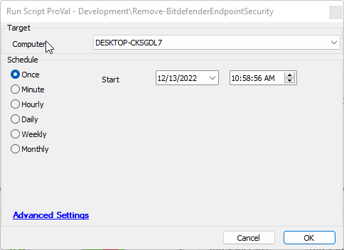

## Summary

This document provides an automated implementation of the agnostic Remove-BitdefenderEndpointSecurity script.

## Sample Run

  
Running this script will remove Bitdefender Endpoint Security from the target system.

## Dependencies

- [SWM - Software Uninstall - Agnostic - Remove-BitdefenderEndpointSecurity](<../../powershell/Remove-BitDefenderEndpointSecurity.md>)

## Process

Please reference the agnostic content process for complete details.

## Output

- Script log

