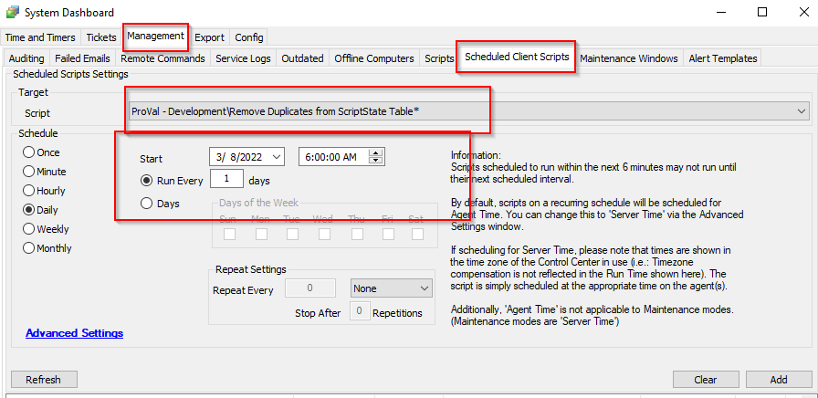

## Summary

Clears duplicate entries from the scriptstate table.  
It is a client script and can be scheduled to run once per day.

## Sample Run

To be scheduled as a client script.  

## Variables

| Name               | Description                                                                                           |
|--------------------|-------------------------------------------------------------------------------------------------------|
| @Count@            | Saves the total number of duplicate variables per script per computer                                 |
| @SqlScriptid@      | Distinct Scriptid                                                                                     |
| @SqlComputerid@    | Distinct Computerid                                                                                   |
| @SqlVariable@      | Distinct Variable                                                                                     |
| @SqlNumberofValues@| Total number of duplicate entries for the distinct variable for the distinct computer for the distinct scriptid |
| @Limit@            | @SqlNumberofValue - 1                                                                                 |
| %sqlresult%        | To refresh the loop counter                                                                            |

## Process

Step 1: Fetches the total number of duplicate entries per scriptid per computerid per variable from the scriptstate table using the following SQL Query:  
`select scriptid, variable, computerid, count(*) as NumberofValues from scriptstate group by scriptid, variable, computerid Having Numberofvalues > 1`

Step 2: Exits, if the total number of results in the above step is zero.  

Step 3: Runs a loop to delete all the duplicate entries for each Script state per computer per script.

